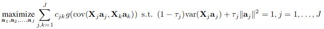
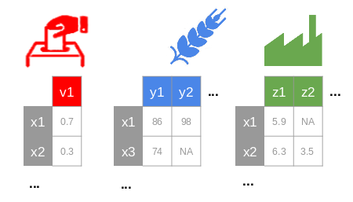
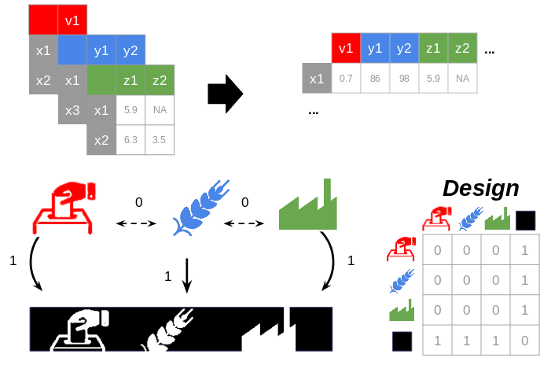
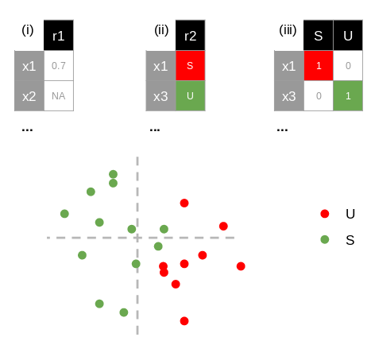
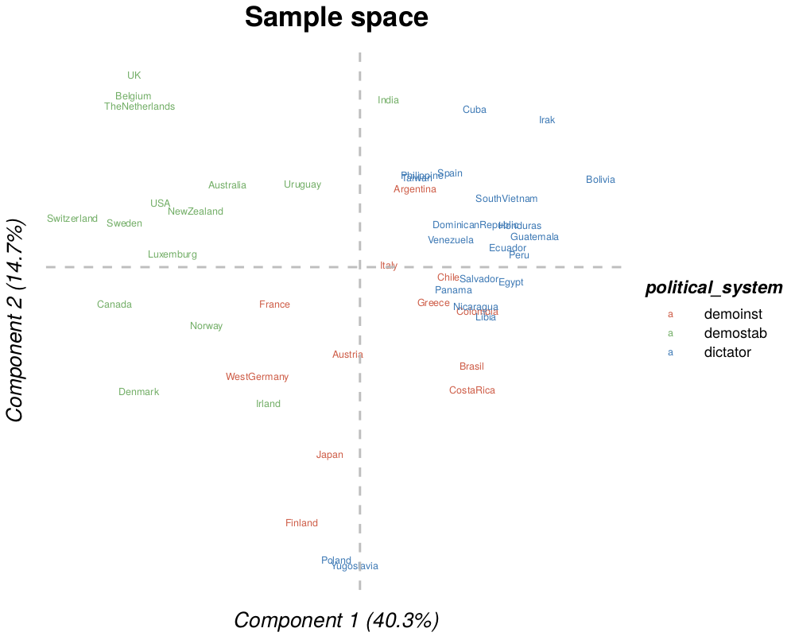
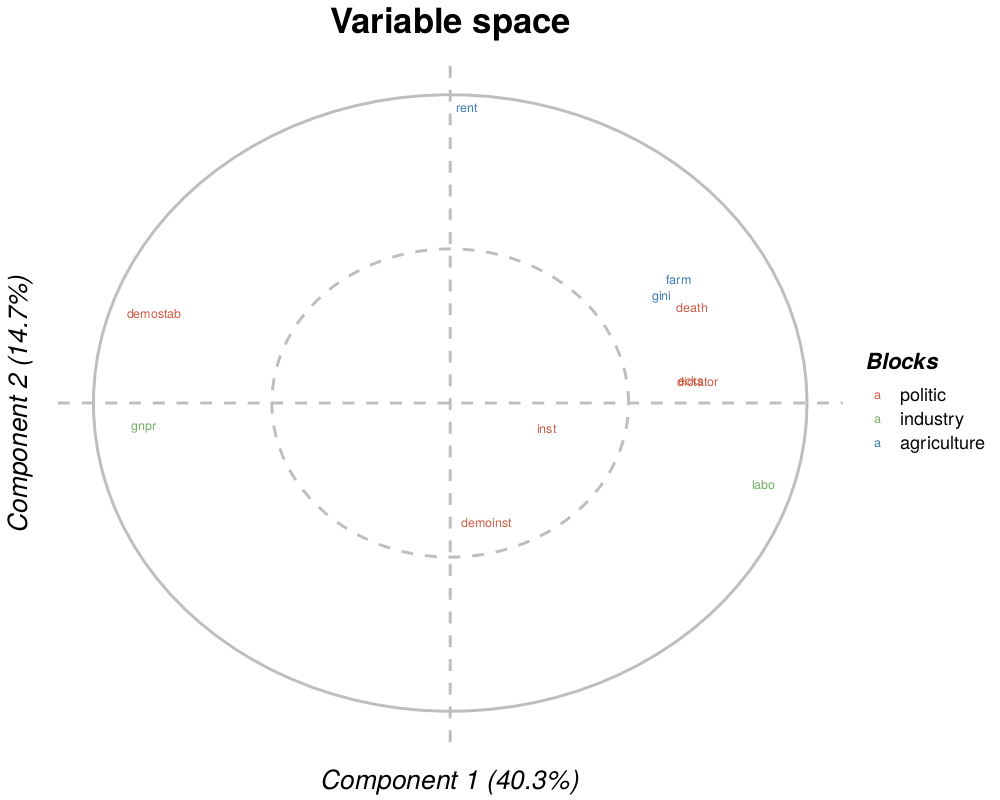
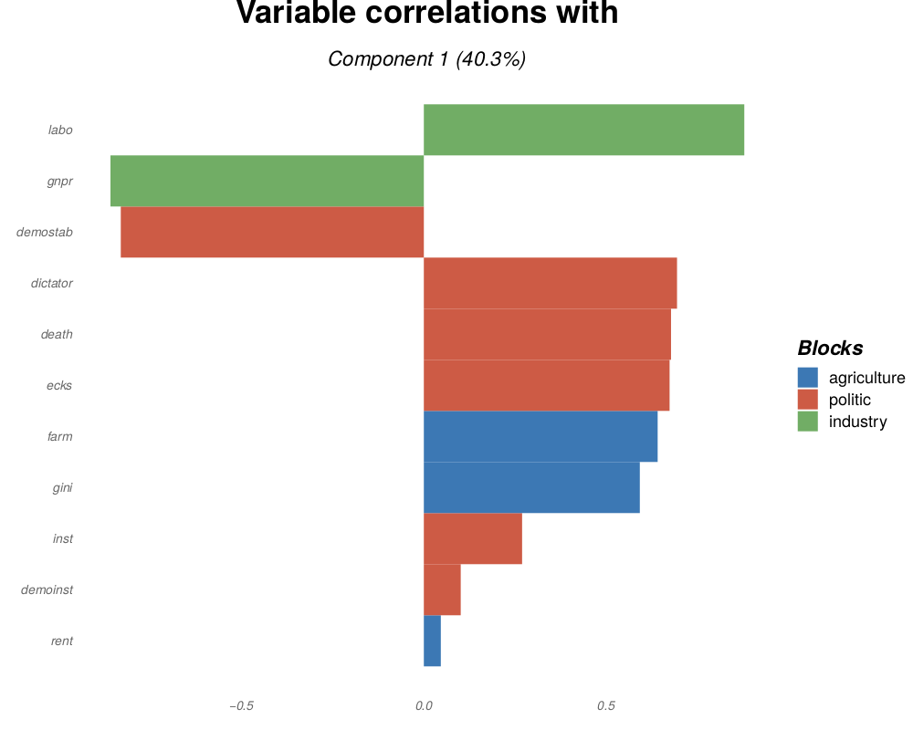
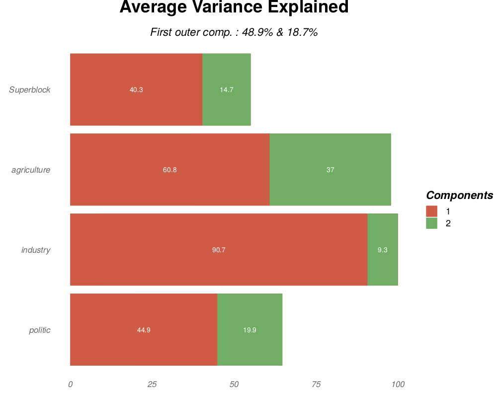
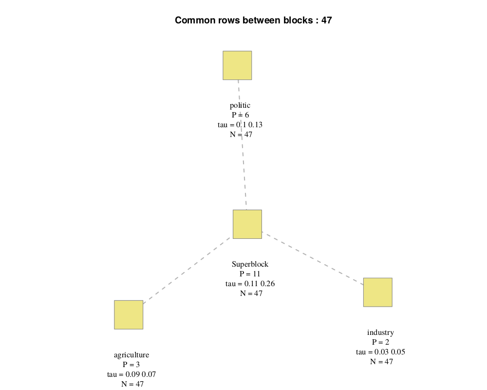

# R/SGCCA

##### Version: 3.0

##### Authors:
Arthur TENENHAUS, Etienne CAMENEN,  Anatole BOURRELIER, Caroline PELTIER & Vincent GUILLEMOT

##### Key-words:
omics, RGCCA, multi-block

##### EDAM operation:
analysis, correlation, visualisation

##### Contact:
arthur.tenenhaus@l2s.centralesupelec.fr

##### Short description
Performs multi-variate analysis (PCA, CCA, PLS, R/SGCCA, etc.) and produces textual and graphical outputs (e.g. variables and individuals plots).

---

## Contents
  - [Description](#description)
  - [Algorithm](#algorithm)
  - [Input files](#input-files)
  - [Output files](#output-files)
  - [Installation](#installation)
    - [Linux](#linux)
    - [Windows & Mac](#windows--mac)
  - [Installation of a development branch from the git repository](#installation-of-a-development-branch-from-the-git-repository)
  - [Execution](#execution)
    - [Shiny interface](#shiny-interface)
    - [Vignette](#vignette)
    - [Command line](#command-line)
      - [Files parameters](#files-parameters)
      - [Analyse parameters](#analyse-parameters)
      - [Graphical parameters](#graphical-parameters)
  - [References](#references)

## Description
A user-friendly multi-blocks analysis (Regularized Generalized Canonical Correlation Analysis, RGCCA) as described in [1] and [2] with all default settings predefined. The software produces figures to explore the analysis' results: individuals and variables projected on two components of the multi-block analysis, list of top variables and explained variance in the model.

## Algorithm
We consider J data matrices X1 ,..., XJ. Each n × pj data matrix Xj = [ xj1, ..., xjpj ] is called a block and represents a set of pj variables observed on n individuals. The number and the nature of the variables may differ from one block to another, but the individuals must be the same across blocks. We assume that all variables are centered. The objective of RGCCA is to find, for each block, a weighted composite of variables (called block component) yj = Xj . aj, j = 1 ,..., J (where aj is a column-vector with pj elements) summarizing the relevant information between and within the blocks. The block components are obtained such that (i) block components explain well their own block and/or (ii) block components that are assumed to be connected are highly correlated. In addition, RGCCA integrates a variable selection procedure, called SGCCA, allowing the identification of the most relevant features.

The second generation RGCCA ([1]) subsumes fifty years of multiblock component methods. It provides important improvements to the initial version of RGCCA ([2]) and is defined as the following optimization problem: 
- The **scheme function** g is any continuous convex function and allows to consider different optimization criteria. Typical choices of g are the identity (horst scheme, leading to maximizing the sum of covariances between block components), the absolute value (centroid scheme, yielding maximization of the sum of the absolute values of the covariances), the square function (factorial scheme, thereby maximizing the sum of squared covariances), or, more generally, for any even integer m, g(x) = x^m (m-scheme, maximizing the power of m of the sum of covariances). The horst scheme penalizes structural negative correlation between block components while both the centroid scheme and the m-scheme enable two components to be negatively correlated. According to [3], a fair model is a model where all blocks contribute equally to the solution in opposition to a model dominated by only a few of the J sets. If fairness is a major objective, the user must choose m = 1. m > 1 is preferable if the user wants to discriminate between blocks. In practice, m is equal to 1, 2 or 4. The higher the value of m the more the method acts as block selector [4].
- The **design matrix** C is a symmetric J × J matrix of nonnegative elements describing the network of connections between blocks that the user wants to take into account. Usually, cjk = 1 for two connected blocks and 0 otherwise.
- The τj are called **shrinkage parameters** ranging from 0 to 1 and interpolate smoothly between maximizing the covariance and maximizing the correlation. Setting the τj to 0 will force the block components to unit variance (var(Xj.aj = 1)), in which case the covariance criterion boils down to the correlation. The correlation criterion is better in explaining the correlated structure across datasets, thus discarding the variance within each individual dataset. Setting τj to 1 will normalize the block weight vectors (aj . t(aj) = 1), which applies the covariance criterion. A value between 0 and 1 will lead to a compromise between the two first options and correspond to the following constraint (1 − τj) . var(Xj.aj) + τj‖aj‖^2 = 1. The choices τj = 1, τj = 0 and 0 < τj < 1 are respectively referred as Modes A, B and Ridge. In the RGCCA package, for each block, the determination of the shrinkage parameter can be made fully automatic by using the analytical formula proposed by (Schäfer and Strimmer 2005). Also, depending on the context, the shrinkage parameters should also be determined based on V-fold cross-validation. We can define the choice of the shrinkage parameters by providing interpretations on the properties of the resulting block components:
    - τj = 1 yields the maximization of a covariance-based criterion. It is recommended when the user wants a stable component (large variance) while simultaneously taking into account the correlations between blocks. The user must, however, be aware that variance dominates over correlation.
    - τj = 0 yields the maximization of a correlation-based criterion. It is recommended when the user wants to maximize correlations between connected components. This option can yield unstable solutions in case of multi-collinearity and cannot be used when a data block is rank deficient (e.g. n < pj).
    - 0 < τj < 1 is a good compromise between variance and correlation: the block components are simultaneously stable and as well correlated as possible with their connected block components. This setting can be used when the data block is rank deficient.

The quality and interpretability of the RGCCA block components yj = Xj . aj, j = 1,...,J are likely affected by the usefulness and relevance of the variables of each block. Accordingly, it is an important issue to identify within each block a subset of significant variables which are active in the relationships between blocks. **SGCCA** extends RGCCA to address this issue of variable selection. Specifically, RGCCA with all τj = 1 equal to 1 is combined with an L1-penalty that gives rise to SGCCA [5]. The SGCCA optimization problem is defined with sj, a user defined positive constant that determines the amount of sparsity for aj, j = 1,...,J. The smaller the sj, the larger the degree of sparsity for aj. The sparsity parameter sj is usually set based on cross-validation procedures. Alternatively, values of sj can simply be chosen to result in desired amounts of sparsity.

## Input files
(see ```int/extdata/``` folder for a [working example](https://github.com/BrainAndSpineInstitute/rgcca_Rpackage/tree/master/inst/extdata)).
- ```blocks``` (.tsv, .csv, .txt or .xls, xlsx): one or multiple required file(s) with the columns separated by tabulations (or semi-colons). Each file corresponds to a block containing only quantitative values with "NA" for missing data and "." for decimal separators (**Fig. 1**). Individuals should be in rows, labelled in the first column with the same name between each block (some samples could be missing in some blocks). Variables should be in columns with a header and no duplication in variable names (between and within blocks).



*Fig. 1: The blocks (e.g., politic, agriculture, industry from Russet data [3]) should have some common individuals, a header and row names.*

- ```connection``` (.tsv, .csv, .txt or .xls, xlsx): an optional file describing the connections between the blocks (**design matrix**). The first column and the first line should have the same names as the blocks. It should contain 1 (if two blocks are related) or 0 values otherwise (**Fig. 2**). The columns are separated by tabulations. It is a symmetric matrix with the same dimension as the number of blocks.
    - By default, the design uses a **superblock** configuration, a block defined as the concatenation of all the other blocks. The space spanned by global components is viewed as a compromise space that integrated all the modalities and facilitates the visualization of the results and their interpretation. The design matrix has 1 values on the whole last line (and last column) except for the diagonal (i.e., all the blocks are connected to the superblock) and 0 values for the other cells (the blocks are not connected to each other).



*Fig. 2: The relation between the blocks is synthesized in a design matrix: 1 for two related blocks, 0 otherwise. By default, all the blocks are related only to a bloc concatenating their values (i.e., superblock).*

- ```response``` (.tsv, .csv, .txt or .xls, xlsx): an optional file used to **color the individuals in the ad hoc plot**. It should contain (i) a single column of either a quantitative (with "NA" for missing data and "." for decimal separators), or (ii) a qualitative variable or (iii) multiple columns corresponding to a disjunctive table (1 or 0 for each modalities; **Fig. 3**). Columns are separated by tabulations. Individuals should be in row, labelled with the first column and with the same names as the blocks.



*Fig. 3: A quantitative (i), a qualitative variable (ii) or a disjunctive table (iii) could color the individual plot.*

## Output files
- ```individuals``` (.pdf, .png, .tiff, .bmp or .jpeg): individuals in a space composed by two components of the analysis (with the percent of explained variance). The points could be colored according to a response (see last section).



- ```corcircle``` (.pdf, .png, .tiff, .bmp or .jpeg): Pearson correlation of the variables of the block with two components of the analysis (with the percent of explained variance). The circle corresponds to a 1 correlation and the dotted one to a 0.5 correlation. If the superblock is selected, colors correspond to the belonging of each variable to each block.



- ```fingerprint``` (.pdf, .png, .tiff, .bmp or .jpeg): top variables in a block, sorted decreasingly by their weights or their correlation with the analysis components.



- ```ave``` (.pdf, .png, .tiff, .bmp or .jpeg): average variance explained (AVE; in X-axis) in percent for each block (in Y-axis) and each component (one color per component). The subtitle gives the AVE for the two first of the outer model (weighted average of the AVE of each block).



- ```connection``` (.pdf, .png, .tiff, .bmp or .jpeg): connection between each block, with:
    - "P", the number of variables
    - "N", the number of lines (here, each block has the same number of line)
    - "tau", the shrinkage parameter (for each component if the optimal option is selected) and "sparsity", the sparsity coefficient (see R/SGCCA section)



- ```individuals``` (.tsv, .csv or .txt): a table containing for each individuals their coordinates on the two first analysis components of each block.

|           | politic.axis1 | politic.axis2 | industry.axis1 |
|-----------|---------------|---------------|----------------|
| Argentina | 0.66          | -0.13         | 0.25           |
| Australia | -1.49         | 0.28          | 1.37           |
| …         | …             | …             | …              |

- ```variables``` (.tsv. .csv or .txt): a table containing for each variable of each block their correlation and their weights for the two first analysis components.

|      | cor.axis.1 | cor.axis.2 | weight.axis.1 | weight.axis.2 | block    |
|------|------------|------------|---------------|---------------|----------|
| inst | 0.33       | -0.27      | 0.16          | 0.05          | politic  |
| ecks | 0.79       | 0.09       | 0.52          | 0.43          | politic  |
| …    | …          | …          | …             | …             | …        |
| gnpr | 0.94       | 0.33       | 0.68          | 2.09          | industry |
| …    | …          | …          | …             | …             | …        |

- ```rgcca_result``` (.RData): a R file containing a RGCCA object from the RGCCA package


## Installation
Required:
- Softwares : R (≥ 3.2.0)
- R libraries : see the [DESCRIPTION](https://github.com/BrainAndSpineInstitute/rgcca_Rpackage/blob/master/DESCRIPTION) file.

### Linux

```
sudo apt-get install -y git r-base && \
    R -e 'install.packages(c("RGCCA", "ggplot2", "optparse", "scales", "igraph", "shiny", "Deriv", "rlang", "ggrepel", "openxlsx")' && \
    git clone https://github.com/rgcca-factory/RGCCA && \
	cd RGCCA
```

On Ubuntu, if dependencies errors appear for igraph and plotly, try :
```
sudo apt-get install -y libxml2-dev libcurl4-openssl-dev libssl-dev liblapack-dev && \
    apt-get update
```

### Windows & Mac
Please, find the software on [Github](https://github.com/BrainAndSpineInstitute/rgcca_Rpackage). Click on the green button in the upper right corner ```Clone and Download``` and then ```Download the ZIP```. Extract the file.

## Installation of a development branch from the git repository
Required:
- Softwares : R (≥ 3.2.0)
- R libraries : see the [DESCRIPTION](https://github.com/BrainAndSpineInstitute/rgcca_Rpackage/blob/master/DESCRIPTION) file.
- The R library `devtools`.

This procedure was tested on `Windows 10` and `Linux 18.04.6 LTS (Bionic Beaver)`. Below is an example in order to install the branch called `CRAN` from the git repository `rgcca-factory`.
```
remove.packages("RGCCA")
devtools::install_github(repo="https://github.com/rgcca-factory/RGCCA.git", ref = "CRAN")
```

## Execution
If the Linux dependencies installation step was not executed previously (e.g., for Windows users), their automatic installation could take several minutes during the first execution. If dependencies compatibility errors appear, the required (and suggested) librairies to import are listed in the [DESCRIPTION](https://github.com/BrainAndSpineInstitute/rgcca_Rpackage/blob/master/DESCRIPTION) file.


### Shiny interface
- Required: shiny, shinyjs, devtools, bsplus (R packages)

[Shiny](https://shiny.rstudio.com/) is a R framework providing a "user-friendly" web interface. When a parameter of the analysis is modified (e.g. the block to visualize), its impact can be directly observed on the graphical outputs.

After installing [Rstudio](https://www.rstudio.com/products/rstudio/download/#download), open ```inst/shiny/server.R``` file with it. In the RStudio upper menu, go to "Tools", "Install packages" and write "shiny" in the textual field. Then, the application could be launched by clicking on the ```Run App button``` in the upper right corner of the script menu bar. Click [here](https://github.com/rgcca-factory/RGCCA/blob/release/3.0.0/inst/shiny/tutorialShiny.md) to read the tutorial.


### Vignette
- Required: markdown, pander (R packages)
- Suggested: LateX

A [vignette](http://r-pkgs.had.co.nz/vignettes.html) is a practical use of the software (with detailed examples). It is usually writen in [R Markdown](https://rmarkdown.rstudio.com/), a notebook interface including text or pieces of code that could be dynamically executed.

On Linux:
```
R -e 'install.packages(c("markdown", "pander"))' && \
    sudo apt-get install -y texlive-latex-base texlive-latex-extra texlive-fonts-recommended texlive-fonts-extra texlive-science
```

On Windows:
- Install [MikTeX](https://miktex.org/download) (All downloads >> Net Installer).
- In the RStudio upper menu, go to "Tools", "Install packages" and write "markdown" in the textual field. Do the same for "pander".

Please, find the Rmarkdown working example at ```vignettes/vignette_rgcca.Rmd```.


### Command line

For direct usage (Example from Russet data from RGCCA package [3]) :

```
Rscript inst/launcher.R -d inst/extdata/agriculture.tsv,inst/extdata/industry.tsv,inst/extdata/politic.tsv
```

#### Files parameters
By default, on tabulated files with a header. The names of the blocks are the filename (or the name of the sheets for an Excel file) without the extension.

- ```-d (--datasets)``` (PATH LIST) [REQUIRED] List of comma-separated file paths corresponding to the blocks to be analyzed (one per block and without spaces between them; e.g. path/file1.txt,path/file2.txt)
- ```-c (--connection)``` (PATH) Path of the file defining the connections between the blocks [if not used, activates the superblock mode]
- ```--group``` (PATH) Path of the file coloring the individuals in the ad hoc plot
- ```-r (--response)``` (INTEGER) Position of the response file for the supervised mode within the block path list [actives the supervised mode]
- ```--names``` (STRING LIST) List of comma-separated block names to rename them (one per block; without spaces between them) [default: the block file names]
- ```-H (--header)``` DO NOT consider the first row as the column header.
- ```--separator``` (INTEGER) Character used to separate columns (1: tabulation, 2: semicolon, 3: comma) [default: tabulation].
- ```--o1``` (PATH) Path for the individuals plot [default: ```individuals.pdf```]
- ```--o2``` (PATH) Path for the corcircle plot [default: ```corcircle.pdf```]
- ```--o3``` (PATH) Path for the top variables plot [default: ```top_variables.pdf```]
- ```--o4``` (PATH) Path for the explained variance plot [default: ```ave.pdf```]
- ```--o5``` (PATH) Path for the design plot [default: ```design.pdf```]
- ```--o6``` (PATH) Path for the individual table [default: ```individuals.tsv```]
- ```--o7``` (PATH) Path for the variable table [default: ```variables.tsv```]
- ```--o8``` (PATH) Path for the analysis results in RData [default: ```rgcca_result.RData```]
- ```--o9``` (PATH) Path for the response correlation plot [default: ```response_correlation.pdf```]

#### Analyse parameters
By default, the analysis: is a Regularised Generalised Canonical Correlation Analysis, scales the blocks, uses a superblock with a factorial scheme function, a tau equals to one and two components for each block.

- ```--method``` (STRING) Type of analysis [default: rgcca] (among: rgcca, pca, cca, gcca, cpca-w, hpca, maxbet-b, maxbet, maxdiff-b, maxdiff, maxvar-a, maxvar-b, maxvar, niles, r-maxvar, rcon-pca, ridge-gca, sabscor, ssqcor, ssqcor, ssqcov-1, ssqcov-2, ssqcov, sum-pca, sumcor, sumcov-1, sumcov-2, sumcov)
- ```--scale``` DO NOT scale the blocks (i.e., a data centering step is always performed). Otherwhise, each block is normalised and divided by the square root of its number of variables.
- ```--superblock``` DO NOT use a superblock (i.e. a concatenation of all the blocks to visualize them all together in a consensus space). In this case, all blocks are assumed to be connected or a connection file could be used.
- ```--ncomp``` (INTEGER) Number of components in the analysis for each block [default: 2]. The number should be higher than 1 and lower than the minimum number of variables among the blocks. It can be a single values or a comma-separated list (e.g 2,2,3,2).
- ```--penalty``` (INTEGER/FLOAT) For RGCCA, a regularization parameter for each block (i.e., tau) [default: optimal value by an ad hoc algorithm]. Tau varies from 0 (maximizing the correlation) to 1 (maximizing the covariance). For SGCCA, tau is automatically set to 1 and a shrinkage parameter can be defined instead for automatic variable selection, varying from the square root of the variable number (the fewest selected variables) to 1 (all the variables are included). It can be a single values or a comma-separated list (e.g. 0,1,0.75,1).
- ```-g (--scheme)``` (INTEGER) Link (i.e. scheme) function for covariance maximization (1: x, 2: x^2, 3: |x|, 4: x^4) [default: factorial]. Only, the x function ('horst scheme') penalizes structural negative correlation. The x^2 function ('factorial scheme') discriminates more strongly the blocks than the |x| ('centroid scheme') one.

#### Graphical parameters
By default, the x-axis and y-axis are respectively the first and the second components, the number of top variables is 100 and  superblock is used.
- ```--text``` DO NOT display the name of the points instead of shapes when plotting.
- ```--compx``` (INTEGER) Component used in the X-axis for biplots and the only component used for histograms [default: 1] (should not be higher than the ```--ncomp``` parameter).
- ```--compy``` (INTEGER) Component used in the Y-axis for biplots [default: 2] should not be higher than the ```--ncomp``` parameter).
- ```--nmark``` (INTEGER) Number maximum of top variables in ad hoc plot [default: 100] (for ```top_variable``` file).
- ```--block``` (INTEGER) Position in the path list of the plotted block (0: the superblock or, if not activated, the last one, 1: the fist one, 2: the 2nd, etc.) [default: the last one].
- ```--block_y``` (INTEGER) Position in the path list of the plotted block for the Y-axis in the individual plot (0: the superblock or, if not activated, the last one, 1: the fist one, 2: the 2nd, etc.) [default: the last one].

## References
1. Tenenhaus, M., Tenenhaus, A., & Groenen, P. J. (2017). Regularized generalized canonical correlation analysis: a framework for sequential multiblock component methods. Psychometrika, 82(3), 737-777.
2. Tenenhaus, A., & Tenenhaus, M. (2011). Regularized generalized canonical correlation analysis. Psychometrika, 76(2), 257.
3. Van de Geer, J. P. (1984). Linear relations amongk sets of variables. Psychometrika, 49(1), 79-94.
4. Schäfer, J., & Strimmer, K. (2005). A shrinkage approach to large-scale covariance matrix estimation and implications for functional genomics. Statistical applications in genetics and molecular biology, 4(1).
5. Tenenhaus, A., & Tenenhaus, M. (2014). Regularized generalized canonical correlation analysis for multiblock or multigroup data analysis. European Journal of operational research, 238(2), 391-403.
