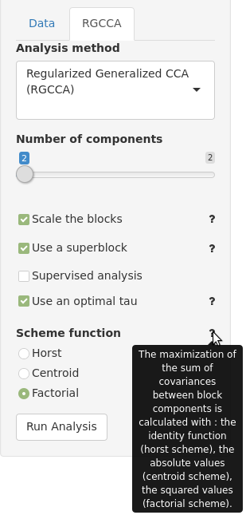
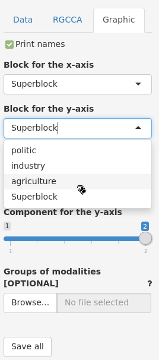
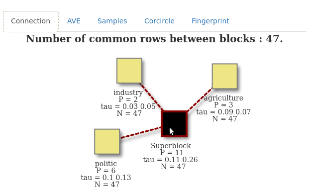
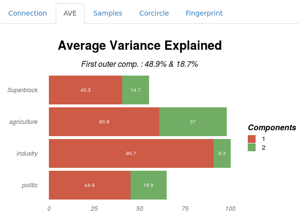
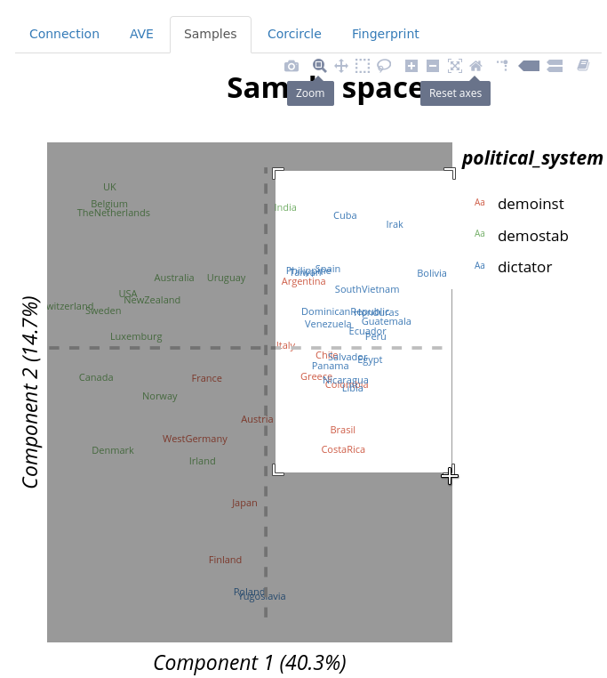
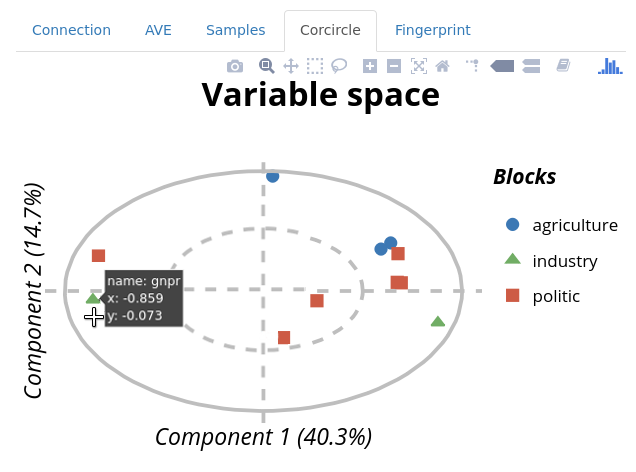
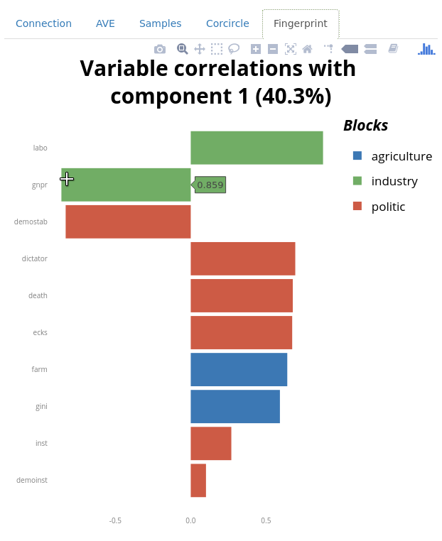

# TUTORIAL FOR RGCCA R-SHINY

##### Version: 1.0

##### Author: Etienne CAMENEN

##### Key-words: 
omics, RGCCA, multi-block

##### EDAM operation: 
analysis, correlation, visualisation

##### Contact: 
arthur.tenenhaus@l2s.centralesupelec.fr

##### Short description
Performs multi-variate analysis (PCA, CCA, PLS, R/SGCCA, etc.) and produces textual and graphical outputs (e.g. variables and individuals plots).

---


## Description


We consider J data matrices X1 ,..., XJ. Each n × pj data matrix Xj = [ xj1, ..., xjpj ] is called a block and represents a set of pj variables observed on n individuals. The number and the nature of the variables may differ from one block to another, but the individuals must be the same across blocks. We assume that all variables are centered. The objective of RGCCA is to find, for each block, a weighted composite of variables (called block component) yj = Xj . aj, j = 1 ,..., J (where aj is a column-vector with pj elements) summarizing the relevant information between and within the blocks. The block components are obtained such that (i) block components explain well their own block and/or (ii) block components that are assumed to be connected are highly correlated. In addition, RGCCA integrates a variable selection procedure, called SGCCA, allowing the identification of the most relevant features (see [here](https://github.com/BrainAndSpineInstitute/rgcca_Rpackage/blob/master/README.md#rsgcca-from-the-cran-vignette-3) for more information).


## 1. Load the inputs ('Data' parameter tab)

Before reading this tutorial, the Shiny application have to be [installed](https://github.com/BrainAndSpineInstitute/rgcca_Rpackage#installation) and [executed](https://github.com/BrainAndSpineInstitute/rgcca_Rpackage#execution).
The ```inst/extdata``` folder includes three blocks with the same individuals (corresponding to the countries here) but different types of variables (agriculture, industry and politic variables). In this dataset, according to Russett (1964), a high agriculture inequality and a low industrial development lead to an unstable political regime. Load the three working examples ```agriculture.tsv```, ```industry.tsv``` and ```politic.tsv``` in the ```blocks``` box (**Fig. 1**) (CTRL + click for multiple selections). The accepted format is one (for PCA) or multiple CSV files containing a matrix with:
- quantitative values only, with decimals separated by '.' and missing values labelled as "NA"
- samples in rows, labelled in the 1rst column with the same sample names between blocks (some samples could be missing in some blocks)
- variables in columns, labelled in the 1rst line without duplications in variable names between blocks

This format recommendation could be viewed with **the mouse over the question mark symbol** on the right of the file loading box.

By default, the character used in ```column separator``` parameter is the ```tabulation```. Change the separator to another one (e.g.,```semicolon```) to observe an error notification: 
> "politic block file has only one column. Check the separator."


 
*Fig. 1 : File loading panel (on the top right). The browsing box is used to load the blocks and the last one, to select the column separator.*


## 2. Analysis parameters ('RGCCA' parameter tab)

The analyse parameters are all set by default and the user could directly click on the ```run analysis``` button. To directly visualize the outputs, see the [last section](https://github.com/BrainAndSpineInstitute/rgcca_Rpackage/blob/master/inst/shiny/tutorialShiny.md#4-visualize-the-plot-tabs).

### 2.1. Analysis methods

After loading the data, a ```RGCCA``` tab will appear (**Fig. 2**). By default, the selected ```analysis method``` is set on ```RGCCA```. This tutorial will be focused on the RGCCA case, but another methods could be selected. When only one block file is loaded in the previous step, a ```PCA``` will be performed. By using two blocks, the interface will allow to select two-blocks analysis method (```PLS``` is selected by default). 



*Fig. 2 : The second parameter panel shows various options to customize the analysis: choose the analysis and the number of components, scale the blocks, choose a shrinkage, use the superblock or a supervised approach, choose a link function. In this example, the mouse over the question mark of scheme function parameter makes a help message appears*


### 2.2. Number of components and scaling

With all analysis methods, the ```number of components``` could be changed. By default, it is set to two components (for biplots). The maximum of components allowed is limited by the minimum number of columns between all datasets. In the case of Russet data, two components are allowed because of the two columns in the industry block. In any cas, five components are the maximum value allowed. 
 
One could also selects ```scale [/ unscale] the blocks```. Either the option is selected or not, a data centering step is always performed. If selected, each block is normalized and then divided by the square root of its number of variables. When the data are already scaled, this step could be avoided by disabling the parameter.

### 2.3. Connection between blocks

This parameters are only accessible with R/SGCCA.

#### 2.3.1. Loading a connection file

The downloaded folder contains a design matrix (```connection.tsv```) corresponding to the relationship between each block: 1 if two blocks are connected and 0 otherwise. The expected format should be tabulation-separated and do not have column and row names. It is a symmetric matrix with the same dimension as the number of blocks. This file allows to add *a priori* information of correlation hypothesis between the blocks. It will not be taken in account with a superblock (see next section). After disabling the ```use a superblock``` option, load this file into the ```Connection design``` file box and observe the result on the plots. The ```connection.tsv``` file contains 1 in all non-diagonal cells and makes the assumption that all the blocks are related.

#### 2.3.2. Superblock 
By default, all the blocks are connected to a superblock, a concatenation of all the other blocks. The space spanned by global components is viewed as a compromise space that integrated all the modalities and facilitates the visualization of the results and their interpretation. To visualize the blocks without the superblock, disable the ```Use a superblock``` option.

#### 2.3.3. Supervised analysis
By selecting ```supervised analysis``` option, a drop-down menu appears to select the block used as a response. By selecting this block, all other blocks (predictors) will be only connected to this block. For example, select the ```agriculture``` block.

If a superblock is used, supervised analysis is automatically disabled, and inversely.

### 2.4. Other R/SGCCA parameters

#### 2.4.1. Shrinkage parameter (Tau)
By selecting a RGCCA,```use an optimal tau``` is automatically set for each block (**Fig. 3**). When disabled, one could make ```tau``` varying for each block from 1 (maximize the correlation between the variables of the selected block) to 0 (maximize the covariance).
 
#### 2.4.2. Sparsity coefficient
By selecting a SGCCA, the ``` sparsity``` could be applied to each block. This coefficient varies from the inverse of the square root of the number of columns (the smaller set of variables) to 1 (all the variables are included).

Move again the cursor to an upper sparsity value to make it works.
 
#### 2.4.3. Scheme function (advanced users)
```Scheme function``` allows to select the link (i.e. scheme) function for covariance maximizations between block components among: 
- identity (```Horst```)
- absolute values (```centroid```)
- squared values (```factorial```)

Only, the horst scheme penalizes structural negative correlation. The factorial scheme discriminates more strongly the blocks than the centroid one.


## 3. Graphical parameters ('Graphic' parameter tab)


This parameter tab is observed only with the ```samples```, ```corcircle``` and ```fingerprint``` plot tabs (**Fig. 3**).



*Fig. 3 : When the samples tab is selected a graphical option panel appears, that includes: (i) the possibility to hide/print the names of the variables, (ii) the selection of the block to visualize, (iii) the components used in the plots, (iv) the loading of groups of response to color the samples and (v) a button to save all the plot in the folder of the Shiny application. In this example, the agriculture block will be selected as the block for the Y-axis.*

### 3.1. Display names
If activated (by default), the ```display names``` option shows the name of the points in the ```samples``` and ```corcircle``` plot tabs. If disabled, shapes are shown instead of text: one per group of modality (see [section 3.4.](https://github.com/BrainAndSpineInstitute/rgcca_Rpackage/blob/master/inst/shiny/tutorialShiny.md#34-color-the-samples)).

### 3.2. Block (for the x/y-axis)
By default, if selected, the ```samples```, ```corcircle``` and ```fingerprint``` plot tabs are shown with the ```superblock``` (i.e., the concatenation of all blocs; see [section 2.3.2](https://github.com/BrainAndSpineInstitute/rgcca_Rpackage/blob/master/inst/shiny/tutorialShiny.md#232-superblocks)) to visualize all the blocs together. If this option is disabled, by default, the last blocks in the drop-down menu ```block``` is used. In this menu, choose another block (e.g., ```agriculture```) to update the plots with your selection (**Fig. 3**). For the ```samples``` tab only, a ```block for the x-axis``` and a ```block for the y-axis``` could be selected.

### 3.3. Components (for the x/y-axis)
The ```component``` of the analysis allows to choose the space where the points are visualised. For ```samples``` and ```corcircle``` biplots tabs, either ```component for the x-axis``` or ```component for the y-axis``` could be set. By default, they are respectively set to the first and the second components. Their choices are limited by the number of components selected in the analysis (defined in the 2.2. section). If the number of components in RGCCA were higher than two (not allowed in the Russet example, because of the industry block), the ```component for the x-axis```, for example, could be set to the third one.

### 3.4. Color the samples
On the ```samples``` plot tab only, one could select a variable to color the points according to a response. For this, load the ``` political_system.tsv``` file in the corresponding ```groups of modalities``` box to update the plot. he expected format is a CSV file tabulation-separated with: 
- qualitative or quantitative values (decimals separated by '.') with missing values labelled as "NA"
- samples in lines, labelled in the 1rst column with the same sample names as the blocks (some samples could be missing)
- a header containing the names of the columns

### 3.5. Number of top variables
Available only for ```fingerprint``` plot tabs, the ```number of top variables``` is automatically set to the number of variables in the selected blocks until a maximum value of 100. For example, with Russet data, eleven "top" variables could be visualised by default on the superblock.

### 3.6. Save the graphics
All graphics could be saved in the tool folder by running the ```Save all``` button (see the [description of the outputs](htps://github.com/BrainAndSpineInstitute/rgcca_Rpackage#output-files)).

### 3.7. Dynamic graph parameters header

In ```samples```, ```corcircle``` and ```fingerprint``` tabs, a header will appear allowing to dynamically explore the graph (see [**Fig. 6**](https://github.com/BrainAndSpineInstitute/rgcca_Rpackage/blob/master/inst/shiny/tutorialShiny.md#43-samples)). From left to right: 
- camera icon saves the plot
- magnifying icon zooms in the plot
- crossed arrows moves the plot
- dashed box makes rectangular selection
- lasso icon makes a fly over selection
- "+" icon zooms in
- "-" icon zooms out
- crossed arrows in a dashed box icon automatically scales the graph
- home icons resets all the changes
- spike lines icon shows the X- and Y- positions on the axes
- label icon (by default) shows the label of a point on fly over
- multiple labels icon shows the labels of a set of points with the nearest X-axis coordinates


## 4. Visualize the plot tabs


Please, make sure that these options are set to visualise the same plots than those in the next examples:
- RGCCA method
- two components
- block scaled
- optimal tau
- a superblock
- factorial scheme

After clicking on the ```run analysis``` button, a set of graphical tabs will appear on the right. By navigating between them, the user could visualize the output of the analysis in various format. On this plots, for the ```samples```, ```corcircle``` and ```fingerprint``` tabs, for each axis of the selected block, the corresponding percent of average explained variance is indicated.

Every modified data or analysis parameter resets the plot tabs and the analysis needs to be re-run to apply the changes.

### 4.1. Connection between blocks
The first tab summarizes the connection between each block: a link corresponds to a "1" value, in the matrix connection file (**Fig. 4**; see [section 2.3.1.](https://github.com/BrainAndSpineInstitute/rgcca_Rpackage/blob/master/inst/shiny/tutorialShiny.md#231-loading-a-connection-file)). For each block:
- "P" is the number of variables
- "N" is the number of lines (here, each block has the same number of line)
- "tau" is the shrinkage parameter and "sparsity" is the sparsity coefficient (see the [2.4.1 & 2.4.2 sections](https://github.com/BrainAndSpineInstitute/rgcca_Rpackage/blob/master/inst/shiny/tutorialShiny.md#24-other-rsgcca-parameters)). The tau parameter could be shown for each component if the optimal option is selected



*Fig. 4 : Connection between each block of the RGCCA and the superblock with 47 common rows between blocks*

### 4.2. Average variance explained (AVE)
In the second tab on the right panel, the average variance explained (AVE; in X-axis) is represented in percent for each block (in Y-axis) and each component (one color per component) (**Fig. 5**). The subtitle informs about the AVE for the two first of the outer model (weighted average of the AVE of each block).



*Fig. 5 : Average variance variance explained (in %) for each block and for the two first components of the RGCCA*

### 4.3. Samples
The first tab is the projection of the sample coordinates in the selected component of the analysis and, by default, on the
superblock (a concatenation of all the blocks) (**Fig. 6**). If a ```response``` file is loaded, each sample is colored according to this variable. In the Russet example, the X-axis could discriminate a dictatorship (with upper values on this axis than the two other political systems), whereas the Y axis discriminates an unstable democracy (with upper values than the others).



*Fig. 6 : Samples coordinates on the two first components for the superblock of the RGCCA after loading the " political_system.tsv" file. By selecting the option in the header of the plot, a zoom could be done on a selected part of the graph (e.g., the upper right part). Then, all the modifications could be reset with the "house" icon.*

### 4.4. Corcircle
The second one corresponds to the Pearson correlation between the variables of the block and the selected components in the analysis (by default, on the two first components) (**Fig. 7**). The circle is a 1 correlation and the dotted one is a 0.5 correlation. If the superblock is selected, colors correspond to the belonging of each variable to each block. Only the 100th variables the most correlated to each axis are printed.



*Fig. 7 : Correlation between each variable of each block (by using the superblock) and the two first components of the RGCCA. The "print names" parameter in the graphical parameter panel is disabled. By flying over a point, an informational label appears. This label gives the name and the X and Y coordinates of the point.*

### 4.5. Top variables
The next tab also represents the same correlation of the variable with the selected component (on the X-axis; 1 by default). The top variables are sorted decreasingly (on the Y-axis) in a histogram among the selected block (superblock, by default) (**Fig. 8**). 



*Fig. 8 : Top 11 variables among all the blocks (by using the superblock) with higher correlation with the first component of the RGCCA. "Gnpr" (belonging to the industry block) shows a correlation of 0.859 with this component.*

Here, "labo" from the industry block (the amount of labor force in agriculture) is the variable the most positively correlated to the X-axis. On the opposite, "gnpr" (gross national product) from the industry block and "demostab" (stable democracy) from the political block are the most negatively correlated variables. In other terms, these variables are the most importants on the first component of the RGCCA. Countries with an unstable democracy are more associated with a lower "rent" (percent of farmers that rent their land). Otherwise, those with a dictatorship system are more associated with a higher labor force in agriculture values and a less gross national product (and inversely for the stable democracy case).