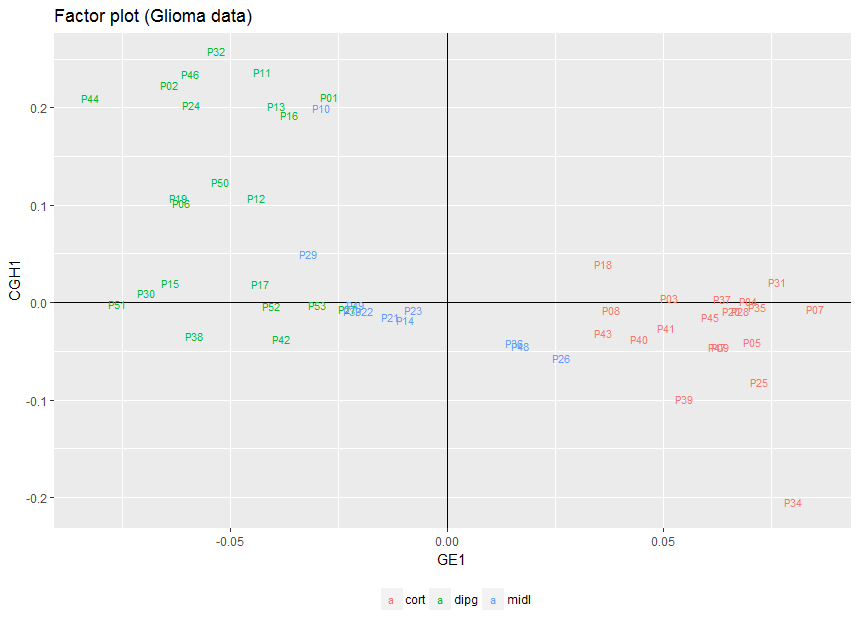
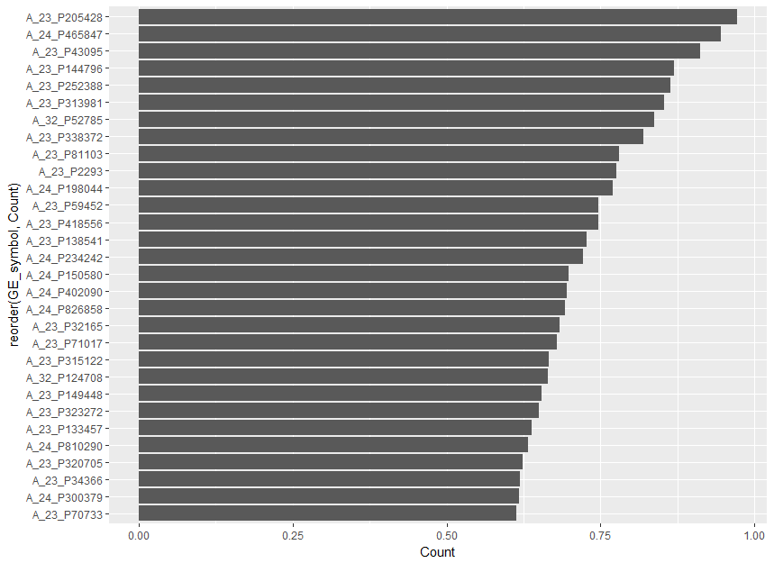
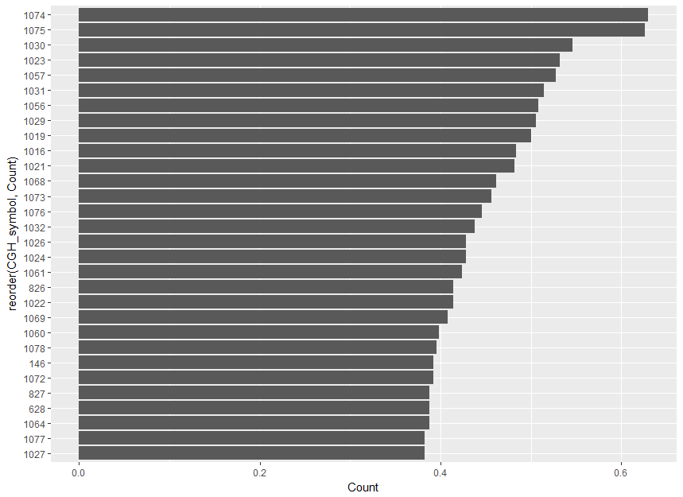

\newcommand{\ma}[1]{\ensuremath{\mathbf{#1}}}
\newcommand{\sign}{\ensuremath{\mathrm{sign}}}
\newcommand{\cov}{\ensuremath{\text{cov}}}
\newcommand{\X}{\mathbf{X}}
\newcommand{\A}{\mathbf{A}}
\newcommand{\Q}{\mathbf{Q}}
\newcommand{\M}{\mathbf{M}}
\newcommand{\mbc}{\mathbf{c}}
\newcommand{\I}{\mathbf{I}}
\newcommand{\mbP}{\mathbf{P}}
\newcommand{\mba}{\mathbf{a}}
\newcommand{\z}{\mathbf{z}}
\newcommand{\w}{\mathbf{w}}
\newcommand{\y}{\mathbf{y}}
\newcommand{\mbb}{\mathbf{b}}
\newcommand{\Xu}{\underline{\mathbf{X}}}
\newcommand{\Pu}{\underline{\mathbf{P}}}
\newcommand{\x}{\mathbf{x}}
\newcommand{\K}{\mathbf{K}}
\newcommand{\mcH}{\mathcal{H}}
\newcommand{\bsx}{\boldsymbol{x}}
\newcommand{\bsxi}{\boldsymbol{\xi}}
\newcommand{\bsa}{\boldsymbol{\alpha}}
\bibliographystyle{apalike}
\bibliography{biblio}


```{r setup, include=FALSE}
knitr::opts_chunk$set(echo = TRUE)
```

```{r, echo = FALSE, warning=FALSE, message = FALSE}
library(ggplot2)
```


# Introduction

A challenging problem in multivariate statistics is to study
relationships between several sets of variables measured on the same
set of individuals. In the literature, this paradigm can be stated
under several names as "learning from multimodal data", "data
integration", "data fusion" or "multiblock data analysis". 
Typical examples are found in large variety of fields such
as biology, chemistry, sensory analysis, marketing, food research, where
the common general objective is to identify variables of each block
that are active in the relationships with other blocks. For instance,
neuroimaging is increasingly recognised as an intermediate phenotype
to understand the complex path between genetics and behavioural or
clinical phenotypes. In this imaging-genetics context, the goal is
primarily to identify a set of genetic biomarker that explains some
neuroimaging variability which implies some modification of the
behavioural. A second application is found in molecular biology where
the completion of the human genome sequence has shifted
research efforts in genomics toward understanding the effect of
sequence variation on gene expression, protein function, or other
cellular mechanims. Both in the imaging-genetics and the multi-modal
genetic context, it is crucial to perform multiple experiments
(e.g. SNPs, functional MRI, behavioural data) on a single set of
patients and the joint analysis of multiple datasets becomes more and
more crucial. The RGCCA package aims to propose a unified and flexible 
framework for that purpose.

# Multiblock data analysis with the RGCCA package

For the sake of comprehension of the use of the RGCCA package, the theoretical fundations of RGCCA and variations - that were previously published [@Tenenhaus2011 ; @Tenenhaus2014 ; @Tenenhaus2015 ; @Tenenhaus2017] - are described. 

We consider $J$ data matrices $\X_1, \ldots, \X_J$. Each $n \times p_j$ data matrix $\X_j = [\ma x_{j1}, \ldots, \ma x_{jp_j}]$ is called a block and represents a set of $p_j$ variables observed on $n$ individuals. The number and the nature of the variables may differ from one block to another, but the individuals must be the same across blocks. We assume that all variables are centered. The objective of RGCCA is to find, for each block, a weighted composite of variables (called block component) $\y_j= \X_j \ma a_j,j=1, \ldots,J$ (where $\ma a_j$ is a column-vector with  $p_j$ elements) summarizing the relevant information between and within the blocks. The block components are obtained such that (i) block components explain well their own block and/or (ii) block components that are assumed to be connected are highly correlated. In addition, RGCCA integrates a variable selection procedure, called SGCCA, allowing the identification of the most relevant features. Finally, as a component-based method, RGCCA/SGCCA can provide users with graphical representations to visualize the sources of variability within blocks and the amount of correlation between blocks.

## Regularized Generalized Canonical Correlation Analysis

The second generation RGCCA [@Tenenhaus2017] subsumes fifty years of multiblock component methods. It provides important improvements to the initial version of RGCCA [@Tenenhaus2011] and is defined as the following optimization problem:

\begin{equation}
\displaystyle \underset{\ma a_1,\ma a_2, \ldots,\ma a_J}{\text{maximize}} \sum_{j, k = 1}^J c_{jk}g(\mathrm{cov}(\X_j\ma a_j, \X_k\ma a_k)) \mathrm{~~s.t.~~} (1-\tau_j)\mathrm{var}(\X_j\ma a_j) + \tau_j\Vert \ma a_j \Vert^2 = 1, j=1, \ldots,J
\label{optim_RGCCA}
\end{equation}

where:

- The scheme function $g$ is any continuous convex function and allows to consider different optimization criteria.  Typical choices of $g$ are the identity (horst scheme, leading to maximizing the sum of covariances between block components), the absolute value (centroid scheme, yielding maximization of the sum of the absolute values of the covariances), the square function (factorial scheme, thereby maximizing the sum of squared covariances), or, more generally, for any even integer $m$, $g(x) = x^m$  (m-scheme, maximizing the power of $m$ of the sum of covariances). The horst scheme penalizes structural negative correlation between block components while both the centroid scheme and the m-scheme enable two components to be negatively correlated. According to [@VandeGeer1984], a fair model is a model where all blocks contribute equally to the solution in opposition to a model dominated by only a few of the $J$ sets. If fairness is a major objective, the user must choose $m=1$.  $m>1$ is preferable if the user wants to discriminate between blocks. In practice, $m$ is equal to $1$, $2$ or $4$. The higher the value of $m$ the more the method acts as block selector [@Tenenhaus2017].

- The design matrix $\ma C$ is a symmetric  $J \times J$ matrix of nonnegative elements describing the network of connections between blocks that the user wants to take into account. Usually, $c_{jk}=1$ for two connected blocks and 0 otherwise.

-	The $\tau_j$  are called shrinkage parameters ranging from $0$ to $1$ and interpolate smoothly between maximizing the covariance and maximizing the correlation. Setting the $\tau_j$ to 0 will force the block components to unit variance ($\mathrm{var}(\X_j\ma a_j = 1)$), in which case the covariance criterion boils down to the correlation. The correlation criterion is better in explaining the correlated structure across datasets, thus discarding the variance within each individual dataset.  Setting $\tau_j$  to 1 will normalize the block weight vectors ($\ma a_j^\top\ma a_j = 1$ ), which applies the covariance criterion. A value between $0$ and $1$ will lead to a compromise between the two first options and correspond to the following constraint $(1-\tau_j)\mathrm{var}(\X_j\ma a_j) + \tau_j \Vert \ma a_j \Vert^2 = 1$ in (\ref{optim_RGCCA}). The choices $\tau_j = 1$,  $\tau_j = 0$ and  $0<\tau_j<1$ are respectively referred as Modes A, B and Ridge. In the RGCCA package, for each block, the determination of the shrinkage parameter can be made fully automatic by using the analytical formula proposed by [@Schafer2005]. Also, depending on the context, the shrinkage parameters should also be determined based on V-fold cross-validation. We can define the choice of the shrinkage parameters by providing interpretations on the properties of the resulting block components:
    + $\tau_j=1$ yields the maximization of a covariance-based criterion. It is recommended when the user wants a stable component (large variance) while simultaneously taking into account the correlations 
between blocks. The user must, however, be aware that variance dominates over correlation.
    + $\tau_j=0$ yields the maximization of a correlation-based criterion. It is recommended when the user wants to maximize correlations between connected components. This option can yield unstable solutions in case of multi-collinearity and cannot be used when a data block is rank deficient (e.g. $n<p_j$).
    +	 $0<\tau_j<1$ is a good compromise between variance and correlation: the block components are simultaneously stable and as well correlated as possible with their connected block components. This setting can be used when the data block is rank deficient. 

From optimization problem (\ref{optim_RGCCA}), the term "generalized" in the acronym of RGCCA embraces at least three notions. The first one relates to the generalization of two-block methods - including Canonical Correlation Analysis [@Hotelling1936]  Interbattery Factor Analysis [@Tucker1958] and Redundancy Analysis [@Wollenberg1977] - to three or more sets of variables. The second one relates to the ability of taking into account some hypotheses on between-block connections: the user decides which blocks are connected and which ones are not. The third one relies on the choices of the shrinkage parameters allowing to capture both correlation or covariance-based criteria.

##	Variable selection in RGCCA: SGCCA

The quality and interpretability of the RGCCA block components $\y_j= \X_j \ma a_j,j=1, \ldots,J$ are likely affected by the usefulness and relevance of the variables of each block. Accordingly, it is an important issue to identify within each block a subset of significant variables which are active in the relationships between blocks. SGCCA extends RGCCA to address this issue of variable selection. Specifically, RGCCA with all $\tau_j=1$ equal to 1 is combined with an L1-penalty that gives rise to SGCCA [@Tenenhaus2014b]. The SGCCA optimization problem is defined as follows:

\begin{equation}
\displaystyle \underset{\mba_1,\mba_2, \ldots,\mba_J}{\text{maximize}} \sum_{j, k = 1}^J c_{jk}g(\mathrm{cov}(\X_j\ma a_j, \X_k\ma a_k)) \mathrm{~~s.t.~~} \Vert \mba_j \Vert_2 = 1 \text{~and~} \Vert \mba_j \Vert_1 \le s_j, j=1,\ldots,J
\label{optim_SGCCA}
\end{equation}

where $s_j$ is a user defined positive constant that determines the amount of sparsity for $\ma a_j, j=1, \ldots,J$. The smaller the $s_j$, the larger the degree of sparsity for $\ma a_j$.  The sparsity parameter $s_j$  is usually set based on cross-validation procedures. Alternatively, values of $s_j$ can simply be chosen to result in desired amounts of sparsity.

##	Higher stage block components
It is possible to obtain more than one block-component per block for RGCCA and SGCCA. Higher stage block components can be obtained using a deflation strategy. This strategy forces all the block components within a block to be uncorrelated. This deflation procedure can be iterated in a very flexible way.  It is not necessary to keep all the blocks in the procedure at all stages: the number of components summarizing a block can vary from one block to another (see [@Tenenhaus2017] for details).

## Implementation
The function `rgccad()`of the RGCCA package implements a monotonically convergent algorithm for the optimization problem (\ref{optim_RGCCA}) - i.e. the bounded criterion to be maximized increases at each step of the iterative procedure -, which hits at convergence a stationary point of (\ref{optim_RGCCA}).  Two numerically equivalent approaches for solving the RGCCA optimization problem are available. A primal formulation described in [@Tenenhaus2017 ; @Tenenhaus2011] requires the handling of matrices of dimension $p_j \times p_j$. A dual formulation described in [@Tenenhaus2015] requires the handling of matrices of dimension $n \times n$ . Therefore, the primal formulation of the RGCCA algorithm will be used when $n>p_j$ and the dual form will be preferred when $n\le p_j$ . The `rgccad()` function of the RGCCA package implements these two formulations and selects automatically the best one. The SGCCA algorithm is similar to the RGCCA algorithm and keeps the same convergence properties. The algorithm associated with the optimization problem (2) is available through the function `sgcca()` of the RGCCA package.

##	Special cases of RGCCA

RGCCA is a rich technique that encompasses a large number of multiblock methods that were published for fifty years. These methods are recovered with RGCCA by appropriately defining the triplet ($\ma C$, $\tau_j$, $g$). Table 1 gives the correspondences between the triplet ($\ma C$, $\tau_j$, $g$) and the associated methods. For a complete overview see [@Tenenhaus2017]. 

|**Methods** |                          $g(x)$ |    $\tau_j$ |                       $\ma C$                      |
|-------------------------------------|----------|---------------------------------------|-------------------------------- |
|**Canonical Correlation Analysis** [@Hotelling1936] |  $x$ | $\tau_1 = \tau_2 = 0$ |$\ma C_1 = \begin{pmatrix}  0 & 1 \\  1 & 0 \end{pmatrix}$ |
|**Interbattery Factor Analysis** [@Tucker1958] |  $x$ | $\tau_1 = \tau_2 = 1$ | $\ma C_1$ |
|**Redundancy Analysis** [@Wollenberg1977] |  $x$ | $\tau_1 = 1$ and $\tau_2 = 0$ | $\ma C_1$  |
|**SUMCOR** [@Horst1961] |  $x$ | $\tau_j = 0, j=1, \ldots, J$ | $\ma C_2 = \begin{pmatrix} 1 & 1 & \cdots &  1 \\ 1 & 1 & \ddots & \vdots \\ \vdots & \ddots& \ddots & 1\\ 1 & \cdots & 1 & 1 \end{pmatrix}$ |
|**SSQCOR** [@Kettenring1971] |  $x^2$ | $\tau_j = 0, 1 \le j \le J$ | $\ma C_2$ |
|**SABSCOR** [@Hanafi2007] |  $abs(x) $ | $\tau_j = 0, 1 \le j \le J$ | $\ma C_2$ |
|**SUMCOV-1** [@VandeGeer1984] |  $x$ | $\tau_j = 1, 1 \le j \le J$ | $\ma C_2$ |
|**SSQCOV-1** [@Hanafi2006] |  $x^2$ | $\tau_j = 1, 1 \le j \le J$ | $\ma C_2$ |
|**SABSCOV-1** [@Tenenhaus2011 ; @Kramer2007] |  $abs(x)$ | $\tau_j = 1, 1 \le j \le J$ | $\ma C_2$ |
|**SUMCOV-2** [@VandeGeer1984]  |  $x$ | $\tau_j = 0, 1 \le j \le J$ | $\ma C_3 = \begin{pmatrix} 0 & 1 & \cdots &  1 \\ 1 & 0 & \ddots & \vdots\\ \vdots & \ddots& \ddots& 1\\ 1 & \cdots & 1 & 0 \end{pmatrix}$ |
|**SSQCOV-2** [@Hanafi2006] | $x^2$ | $\tau_j = 1, 1 \le j \le J$ | $\ma C_3$ |
|**Generalized CCA** [@Carroll1968a] |  $x^2$ | $\tau_j = 0, 1 \le j \le J+1$ | $\ma C_4 = \begin{pmatrix} 0 & \cdots &  0 & 1 \\ \vdots & \ddots & \vdots &  \vdots\\ 0 & \cdots & 0 & 1\\ 1 & \cdots & 1 & 0 \end{pmatrix}$ |
|**Generalized CCA** [@Carroll1968b] |  $x^2$ | $\tau_j=0, 0 \leq j \leq J_1 = 0 ~\&~\tau_{J+1} = 0$ and $\tau_j = 1, J_1+1 \leq j \leq J$ | $\ma C_4$ |
|**Hierarchical PCA** [@Wold1996] |  $x^4$ | $\tau_j = 1, 1 \le j \le J$ and $\tau_{J+1} = 0$ | $\ma C_4$ |
|**Multiple Co-Inertia Analysis** [@Chessel1996] |  $x^2$ | $\tau_j = 1, 1 \le j \le J$ and $\tau_{J+1} = 0$ | $\ma C_4$ |
|**PLS path modeling - mode B** [@Wold1982] |  $abs(x)$ | $\tau_j = 0, 1 \le j \le J$ | $c_{jk}=1$ for two connected block and $c_{jk} = 0$ otherwise |

Table: Special cases of RGCCA in a situtation of $J \ge 2$ blocks. When $\tau_J+1$ is introduced, it is assumed that  $\ma X_1, \ldots, \ma X_J$ are connected to a $(J + 1)$th block defined as the concatenation of the blocks, $\ma X_{J+1} = \bigg[\ma X_1 , \ma X_2, \ldots, \ma X_J \bigg]$ and that $\tau_{J+1}$ corresponds to the shrinkage parameter associated with $\ma X_{J+1}$.

For all the methods of Table 1, a single very simple monotonically convergent gradient-based algorithm is implemented within the RGCCA package and gives at convergence a solution of the stationary equations related to the optimization problem (\ref{optim_RGCCA}). In addition, SGCCA offers a sparse counterpart to all the covariance-based methods of RGCCA. From these perspectives, R/SGCCA provide a general framework for exploratory data analysis of multiblock datasets that has immediate practical consequences for a unified statistical analysis and implementation strategy. 

The methods cited in Table 1 are recovered with the `rgccad()` function by appropriately tuning the arguments `C`, `tau` and `scheme` associated with the triplet ($\ma C$, $\tau_j$, $g$). All the methods of Table 1 are obtained as follows:

### Principal Component Analysis.

Principal Component Analysis is defined as the following optimization problem 

\begin{equation}
\underset{\ma a}{\text{maximize}} \text{~~var}\left(\X \ma a \right) \mathrm{~s.t.~} \Vert \ma a \Vert = 1
\label{PCA1}
\end{equation}

and is obtained with the `rgccad()` function as follows:

```{r, eval = FALSE}
# one block X 
# Design matrix C
# Shrinkage parameters tau = c(tau1, tau2)

pca.with.rgcca = rgccad(A = list(X, X),
                       C = matrix(c(0, 1, 1, 0), 2, 2),
                       tau = c(1, 1))
```

### Canonical Correlation Analysis

Canonical Correlation Analysis is defined as the following optimization problem 

\begin{equation}
\underset{\ma a_1, \ma a_2}{\text{maximize}} \text{
~~cor}\left(\X_1\ma a_1, \X_2\ma a_2 \right) \mathrm{~s.t.~} \text{var}(\X_1\ma a_1) = \text{var}(\X_2\ma a_2) = 1
\label{CCA}
\end{equation}

and is obtained with the `rgccad()` function as follows:


```{r, eval = FALSE}
# X1 = Block1 and X2 = Block2 
# Design matrix C
# Shrinkage parameters tau = c(tau1, tau2)

cca.with.rgcca = rgccad(A= list(X1, X2),
                       C = matrix(c(0, 1, 1, 0), 2, 2),
                       tau = c(0, 0))
```

### PLS regression ($\approx$ Interbattery factor analysis)

PLS regression is defined as the following optimization problem 

\begin{equation}
\underset{\ma a_1, \ma a_2}{\text{maximize}} \text{
~~cov}\left(\X_1\ma a_1, \X_2\ma a_2 \right) \mathrm{~s.t.~} \Vert \ma a_1 \Vert = \Vert \ma a_2 \Vert = 1
\label{PLS}
\end{equation}

and is obtained with the `rgccad()` function as follows:


```{r, eval = FALSE}
# X1 = Block1 and X2 = Block2 
# Design matrix C
# Shrinkage parameters tau = c(tau1, tau2)

pls.with.rgcca = rgccad(A= list(X1, X2),
                       C = matrix(c(0, 1, 1, 0), 2, 2),
                       tau = c(1, 1))
```

### Redundancy Analysis of $\X_1$ with respect to $\X_2$

Redundancy Analysis of $\X_1$ with respect to $\X_2$ is defined as the following optimization problem 

\begin{equation}
\underset{\ma a_1, \ma a_2}{\text{maximize}} \text{
~~cor}\left(\X_1 \ma a_1, \X_2 \ma a_2 \right) \times \text{
var}\left(\X_1\ma a_1\right)^{1/2} \mathrm{~s.t.~} \Vert \ma a_1 \Vert = \text{var}(\X_2\ma a_2) = 1
\label{RA}
\end{equation}

and is obtained with the `rgccad()` function as follows:

```{r, eval = FALSE}
# X1 = Block1 and X2 = Block2 
# Design matrix C
# Shrinkage parameters tau = c(tau1, tau2)

ra.with.rgcca = rgccad(A= list(X1, X2),
                       C = matrix(c(0, 1, 1, 0), 2, 2),
                       tau = c(1, 0))
```

### Regularized Canonical Correlation Analysis [@Vinod1976 ; @Shawe2004]

Regularized Canonical Correlation Analysis is defined as the following optimization problem 

\begin{equation}
\underset{\ma a_1, \ma a_2}{\text{maximize}} \text{
~~cov}\left(\X_1\ma a_1, \X_2\ma a_2 \right) \mathrm{~s.t.~} \tau_j
\Vert \ma a_j \Vert^2 + (1-\tau_j)\text{var}(\X_j\ma a_j) = 1, j =1,2
\label{rCCA}
\end{equation}

and is obtained with the `rgccad()` function as follows:

```{r, eval = FALSE}
# X1 = Block1 and X2 = Block2 
# Design matrix C
# Shrinkage parameters tau = c(tau1, tau2)

rcca.with.rgcca = rgccad(A= list(X1, X2),
                       C = matrix(c(0, 1, 1, 0), 2, 2),
                       tau = c(0<tau1<1, 0<tau2<1))
```

For various extreme cases $\tau_1 = 0$ or $1$ and $\tau_2 = 0$ or $1$, optimization problem 
(\ref{rCCA}) covers a situation which goes from Tucker's interbattery factor 
analysis to Canonical Correlation Analysis while passing through redundancy analysis. 
This framework corresponds exactly to the one proposed 
by [@Borga1997] and [@Burnham1996]. Moreover, the special situation where $0 \le \tau_1 \le 1$ and $\tau_2 = 0$ which corresponds to a regularized version of redundancy analysis has been studied by 
[@Takane2007] and by [@Bougeard2008] under the name "Continuum 
redundancy-PLS regression". When one block is reduced to only one variable, 
optimization problem (\ref{rCCA}) is equivalent to the simple continuum 
regression approach proposed by [@Qannari2005].

### SUMCOV-1

SUMCOV-1 is defined as the following optimization problem 

\begin{equation}
\underset{\ma a_1, \ma a_2, \ldots,\ma a_J} {\text{maximize}} \displaystyle \sum_{j, k = 1}^J \text{cov}(\ma X_j\ma a_j, \ma X_k\ma a_k) \text{~~s.t~~} \Vert \ma a_j \Vert = 1, j=1, \ldots, J
\end{equation}

and is obtained with the `rgccad()` function as follows:


```{r, eval = FALSE}
# X1 = Block1, ..., XJ = BlockJ
# J*J Design matrix C
# Shrinkage parameters tau = c(tau1, ...,  tauJ)

sumcov.with.rgcca = rgccad(A= list(X1, ..., XJ),
                       C = matrix(1, J, J),
                       tau = rep(1, J),
                       scheme = "horst")
```

### SSQCOV-1

SSQCOV-1 is defined as the following optimization problem 

\begin{equation}
\underset{\ma a_1, \ma a_2, \ldots,\ma a_J} {\text{maximize}} \displaystyle \sum_{j, k = 1}^J \text{cov}^2(\ma X_j\ma a_j, \ma X_k\ma a_k) \text{~~s.t~~} \Vert \ma a_j \Vert = 1, j=1, \ldots, J
\end{equation}

and is obtained with the `rgccad()` function as follows:

```{r, eval = FALSE}
# X1 = Block1, ..., XJ = BlockJ
# J*J Design matrix C
# Shrinkage parameters tau = c(tau1, ...,  tauJ)

ssqcov.with.rgcca = rgccad(A= list(X1, ..., XJ),
                       C = matrix(1, J, J),
                       tau = rep(1, J),
                       scheme = "factorial")
```

### SABSCOV

SABSCOV is defined as the following optimization problem 

\begin{equation}
\underset{\ma a_1, \ma a_2, \ldots,\ma a_J} {\text{maximize}} \displaystyle \sum_{j, k = 1}^J \vert \text{cov}(\ma X_j\ma a_j, \ma X_k\ma a_k) \vert \text{~~s.t~~} \Vert \ma a_j \Vert = 1, j=1, \ldots, J
\end{equation}

and is obtained with the `rgccad()` function as follows:

```{r, eval = FALSE}
# X1 = Block1, ..., XJ = BlockJ
# J*J Design matrix C
# Shrinkage parameters tau = c(tau1, ...,  tauJ)

sabscov.with.rgcca = rgccad(A= list(X1, ..., XJ),
                       C = matrix(1, J, J),
                       tau = rep(1, J),
                       scheme = "centroid")
```

### SUMCOR


SUMCOR is defined as the following optimization problem 

\begin{equation}
\underset{\ma a_1, \ma a_2, \ldots,\ma a_J} {\text{maximize}} \displaystyle \sum_{j, k = 1}^J \text{cor}(\ma X_j\ma a_j, \ma X_k\ma a_k) \text{~~s.t~~} \text{var}(\X_j \ma a_j) = 1, j=1, \ldots, J
\end{equation}

and is obtained with the `rgccad()` function as follows:

```{r, eval = FALSE}
# X1 = Block1, ..., XJ = BlockJ
# J*J Design matrix C
# Shrinkage parameters tau = c(tau1, ...,  tauJ)

sumcor.with.rgcca = rgccad(A= list(X1, ..., XJ),
                       C = matrix(1, J, J),
                       tau = rep(0, J),
                       scheme = "horst")
```

### SSQCOR

SSQCOR is defined as the following optimization problem 

\begin{equation}
\underset{\ma a_1, \ma a_2, \ldots,\ma a_J} {\text{maximize}} \displaystyle \sum_{j, k = 1; k \ne j}^J  \text{cor}^2(\ma X_j\ma a_j, \ma X_k\ma a_k) \text{~~s.t~~} \text{var}(\X_j \ma a_j) = 1, j=1, \ldots, J
\end{equation}

and is obtained with the `rgccad()` function as follows:

```{r, eval = FALSE}
# X1 = Block1, ..., XJ = BlockJ
# J*J Design matrix C
# Shrinkage parameters tau1, ...,  tauJ

ssqcor.with.rgcca = rgccad(A= list(X1, ..., XJ),
                       C = matrix(1, J, J),
                       tau = rep(0, J),
                       scheme = "factorial")
```

### SABSCOR

SABSCOR is defined as the following optimization problem 

\begin{equation}
\underset{\ma a_1, \ma a_2, \ldots,\ma a_J} {\text{maximize}} \displaystyle \sum_{j, k = 1}^J \vert \text{cor}(\ma X_j\ma a_j, \ma X_k\ma a_k) \vert \text{~~s.t~~} \text{var}(\X_j \ma a_j) = 1, j=1, \ldots, J
\end{equation}

and is obtained with the `rgccad()` function as follows:


```{r, eval = FALSE}
# X1 = Block1, ..., XJ = BlockJ
# J*J Design matrix C
# Shrinkage parameters tau = c(tau1, ...,  tauJ)

sabscor.with.rgcca = rgccad(A= list(X1, ..., XJ),
                      C = matrix(1, J, J),
                       tau = rep(0, J),
                       scheme = "centroid")
```

### SUMCOV-2

SUMCOV-2 is obtained from following optimization problem 

\begin{equation}
\underset{\ma a_1, \ma a_2, \ldots,\ma a_J} {\text{maximize}} \displaystyle \sum_{j, k = 1 ; j \ne k}^J  \text{cov}(\ma X_j\ma a_j, \ma X_k\ma a_k) \text{~~s.t~~} \Vert \ma a_j \Vert = 1, j=1, \ldots, J
\end{equation}

and is obtained with the `rgccad()` function as follows:

```{r, eval = FALSE}
# X1 = Block1, ..., XJ = BlockJ
# J*J Design matrix C
C = matrix(1, J, J) ; diag(C) = 0
# Shrinkage parameters tau = c(tau1, ...,  tauJ)
maxbet.with.rgcca = rgccad(A= list(X1, ..., XJ),
                       C = C,
                       tau = rep(1, J),
                       scheme = "horst")
```

### SSQCOV-2

SSQCOV-2 is obtained from following optimization problem 

\begin{equation}
\underset{\ma a_1, \ma a_2, \ldots,\ma a_J} {\text{maximize}} \displaystyle \sum_{j, k = 1; j \ne k}^J \text{cov}^2(\ma X_j\ma a_j, \ma X_k\ma a_k) \text{~~s.t~~} \Vert \ma a_j \Vert = 1, j=1, \ldots, J
\end{equation}

and is obtained with the `rgccad()` function as follows:

```{r, eval = FALSE}
# X1 = Block1, ..., XJ = BlockJ
# J*J Design matrix C
C = matrix(1, J, J) ; diag(C) = 0
# Shrinkage parameters tau = c(tau1, ...,  tauJ)
maxbetb.with.rgcca = rgccad(A= list(X1, ..., XJ),
                       C = C,
                       tau = rep(1, J),
                       scheme = "factorial")
```

### Generalized CCA [@Carroll1968a]

For Carroll's Generalized Canonical Correlation Analysis (GCCA), a superblock $\ma X_{J+1} = \left[\ma X_1, \dots, \ma X_J \right]$ defined as the concatenation of all the blocks is introduced. GCCA is defined as the following optimization problem 

\begin{equation}
\underset{\ma a_1, \ma a_2, \ldots,\ma a_J} {\text{maximize}} \displaystyle \sum_{j=1}^J \text{cor}^2(\ma X_j\ma a_j, \ma X_{J+1}\ma a_{J+1}) \text{~~s.t~~} \text{var}(\X_j \ma a_j) = 1, j=1, \ldots, J+1
\end{equation}

and is obtained with the `rgccad()` function as follows:


```{r, eval = FALSE}
# X1 = Block1, ..., XJ = BlockJ, X_{J+1} = [X1, ..., XJ]
# (J+1)*(J+1) Design matrix C
C = matrix(c(0, 0, 0, ..., 0, 1,
             0, 0, 0, ..., 0, 1,
             0, 0, 0, ..., 0, 1,
                  ...
             1, 1, 1, ..., 1, 0), J+1, J+1)
# Shrinkage parameters tau = c(tau1, ...,  tauJ, tau_{J+1})
gcca.with.rgcca = rgccad(A= list(X1, ..., XJ, cbind(X1, ..., XJ)),
                       C = C,
                       tau = rep(0, J+1),
                       scheme = "factorial")
```

### Multiple Co-Inertia Analysis

For Multiple Co-Inertia Analysis (MCOA) a superblock $\ma X_{J+1} = [\ma X_1, \dots, \ma X_J$ defined as the concatenation of all the blocks is introduced. MCOA is defined as the following optimization problem 

\begin{equation}
\underset{\ma a_1, \ma a_2, \ldots,\ma a_J} {\text{maximize}} \displaystyle \sum_{j=1}^J \text{cor}^2(\ma X_j\ma a_j, \ma X_{J+1}\ma a_{J+1})\times \text{var}(\X_j\ma a_j), \text{~~s.t~~} \Vert \ma a_j \Vert = 1, j=1, \ldots, J \text{~~and~~} \text{var}(\X_{J+1}\ma a_{J+1}) = 1
\end{equation}

and is obtained with the `rgccad()` function as follows:


```{r, eval = FALSE}
# X1 = Block1, ..., XJ = BlockJ, X_{J+1} = [X1, ..., XJ]
# (J+1)*(J+1) Design matrix C
C = matrix(c(0, 0, 0, ..., 0, 1,
             0, 0, 0, ..., 0, 1,
             0, 0, 0, ..., 0, 1,
                   ...
             1, 1, 1, ..., 1, 0), J+1, J+1)
# Shrinkage parameters tau = c(tau1, ...,  tauJ, tau_{J+1})
mcoa.with.rgcca = rgccad(A= list(X1, ..., XJ, cbind(X1, ..., XJ)),
                       C = C,
                       tau = c(rep(1, J), 0),
                       scheme = "factorial")
```


### Hierarchical Principal Component Analysis

For Hierarchical Principal Component Analysis (HPCA), a superblock $\ma X_{J+1} = [\ma X_1, \dots, \ma X_J]$ defined as the concatenation of all the blocks is introduced. HPCA is defined as the following optimization problem 

\begin{equation}
\underset{\ma a_1, \ma a_2, \ldots,\ma a_J} {\text{maximize}} \displaystyle \sum_{j=1}^J \text{cov}^4(\ma X_j\ma a_j, \ma X_{J+1}\ma a_{J+1}), \text{~~s.t~~} \Vert \ma a_j \Vert = 1, j=1, \ldots, J \text{~~and~~} \text{var}(\X_{J+1}\ma a_{J+1}) = 1
\end{equation}

and is obtained with the `rgccad()` function as follows:

```{r, eval = FALSE}
# X1 = Block1, ..., XJ = BlockJ, X_{J+1} = [X1, ..., XJ]
# (J+1)*(J+1) Design matrix C
C = matrix(c(0, 0, 0, ..., 0, 1,
             0, 0, 0, ..., 0, 1,
             0, 0, 0, ..., 0, 1,
                  ...
             1, 1, 1, ..., 1, 0), J+1, J+1)
# Shrinkage parameters tau = c(tau1, ...,  tauJ, tau_{J+1})
hpca.with.rgcca = rgccad(A= list(X1, ..., XJ, cbind(X1, ..., XJ)),
                       C = C,
                       tau = c(rep(1, J), 0),
                       #flexible design of the scheme function
                       scheme = function(x) x^4) 
```

### Principal Component Analysis (alternative formulation)

Let $\ma X =[\ma x_1, \ldots, \ma x_p]$ be a $n \times p$ data matrix. PCA can be defined as the following optimization problem 

\begin{equation}
\underset{\ma a}{\text{maximize}} \displaystyle \sum_{j=1}^p \text{cor}^2(\ma x_{j}, \ma X \ma a) \text{~~s.t~~} \text{var}(\ma X \ma a)=1
\end{equation}

and is obtained with the `rgccad()` function as follows:

```{r, eval = FALSE}
# one block X = [x1, ..., xJ] with J variables x1, ..., xJ
# (J+1)*(J+1) Design matrix C
C = matrix(c(0, 0, 0, ..., 0, 1,
             0, 0, 0, ..., 0, 1,
             0, 0, 0, ..., 0, 1,
                  ...
             1, 1, 1, ..., 1, 0), J+1, J+1)
# Shrinkage parameters tau = c(tau1, ...,  tauJ, tau_{J+1})
pca.with.rgcca = rgccad(list(x1, ..., xJ, X),
                       C = C,
                       tau = c(rep(0, J+1), 0),
                       #flexible design of the scheme function
                       scheme = function(x) x^2) 
```

# Practical session

## RGCCA for the Russett dataset.

In this section, we propose to reproduce some of the results presented in [@Tenenhaus2011] for the Russett data. The Russett dataset is available within the RGCCA package. The Russett data set [@Russett1964] are studied in [@Gifi1990]. Russett collected this data to study relationships between Agricultural Inequality, Industrial Development and Political Instability.

```{r}
library(RGCCA)
data(Russett)
head(Russett)
```

The first step of the analysis is to define the blocks. Three blocks of variables have been defined for 47 countries. The variables that compose each block have been defined according to the nature of the variables.

- The first block $\X_1$ = [GINI, FARM, RENT] is related to "Agricultural Inequality":
    + GINI = Inequality of land distribution,
    + FARM = \% farmers that own half of the land (> 50),
    + RENT = \% farmers that rent all their land.

- The second block $\X_2$ = [GNPR, LABO] describes "Industrial Development":
    + GNPR = Gross national product per capita ($1955),
    + LABO = % of labor force employed in agriculture.

- The third one $\X_3$ = [INST, ECKS, DEAT] measures "Political Instability":
    + INST = Instability of executive (45-61),
    + ECKS = Number of violent internal war incidents (46-61),
    + DEAT = Number of people killed as a result of civic group violence (50-62).
    + An additional variable DEMO describes the political regime: stable democracy, unstable democracy or dictatorship. The dummy variable "unstable democracy" has been left out because of redundancy.

The different blocks of variables $\ma X_1, \ldots, \ma X_J$ are arranged in the list format.

```{r}
X_agric = as.matrix(Russett[,c("gini","farm","rent")])
X_ind = as.matrix(Russett[,c("gnpr","labo")])
X_polit = as.matrix(Russett[ , c("inst", "ecks",  "death",
                                 "demostab", "dictator")])
A = list(X_agric, X_ind, X_polit)
sapply(A, head)
```

**Preprocessing** In order to ensure comparability between variables standardization is applied (zero mean and unit variance).

```{r}
A = lapply(A, function(x) scale2(x, bias = TRUE))
```

We note that to make blocks comparable, a possible strategy is to standardize the variables and then to divide each block by the square root of its number of variables [@Westerhuis1998]. This two-step procedure leads to $\mathrm{tr}(\ma X_j^t \ma X_j )=n$  for each block (i.e. the sum of the eigenvalues of the covariance matrix of $\ma X_j$ is equal to $1$ whatever the block). Such a preprocessing is reached by setting the `scale` argument to `TRUE` (default value) in the `rgccad()` and `sgcca()` functions.

**Definition of the design matrix $\mathbf{C}$.** From Russett's hypotheses, it is difficult for a country to escape dictatorship when its agricultural inequality is above-average and its industrial development below-average. These hypotheses on the relationships between blocks are depicted in Figure \ref{fig:C}.

\begin{figure}[!!!h]
\centering
\begin{tikzpicture}
\tikzstyle{every node}=[draw,shape=circle,auto,node distance=3.5cm];
\node (Polit) {Polit};
\node (Agric) [below left of=Polit] {Agric};
\node (Indust) [above left of=Polit] {Indust};
\draw (Agric) -- (Polit)
(Indust) -- (Polit);
\end{tikzpicture}
\caption{between-block connection.}
\label{fig:C}
\end{figure}

and encoded through the design matrix $\mathbf{C}$; usually $c_{jk} = 1$ for two connected blocks and $0$ otherwise. Therefore, we have decided to connect Agricultural Inequality to Political Instability ($c_{13} = 1$), Industrial Development to Political Instability ($c_{23} = 1$) and to not connect Agricultural Inequality to Industrial Development ($c_{12} = 0$). The resulting design matrix $\ma C$ is:

```{r}
#Define the design matrix C.
C = matrix(c(0, 0, 1,
0, 0, 1,
1, 1, 0), 3, 3)

C
```

RGCCA using the pre-defined design matrix $\ma C$, the factorial scheme ($g(x) = x^2$) and mode B for all blocks (full correlation criterion) is obtained by specifying appropriately the `C`, `scheme` and `tau` arguments of the `rgccad()` function. The `verbose` argument (default value = `TRUE`) indicates that the progress will be reported while computing and that a plot representing the convergence of the algorithm will be returned.


```{r}
rgcca_B_factorial = rgccad(A, C, tau = rep(0, 3), scheme = "factorial",
scale = FALSE, verbose = TRUE)
```


The weight vectors, solution of the optimization problem (\ref{optim_RGCCA}) are obtained as:

```{r}
rgcca_B_factorial$a # weight vectors
```

and correspond exactly to the weight vectors reported in [@Tenenhaus2011, see Figure 4]. The block-components are also avalaible as output of `rgcca`. The first components of each block are given by:

```{r}
Y = rgcca_B_factorial$Y
lapply(Y, head)
```

Moreover, using the idea of Average Variance Explained (AVE), the following indicators of model quality are proposed:

- The AVE of block $\ma X_j$, denoted by AVE($\ma X_j$), is defined as:

\begin{equation}
\mathrm{AVE}(\ma X_j)=  1/p_j \sum_{h=1}^{p_j} cor^2( \ma x_{jh},\ma y_j)
\end{equation}

AVE($\ma X_j$) varies between 0 and 1 and reflects the proportion of variance captured by $\ma y_j$.

- For all blocks:

\begin{equation}
\displaystyle \mathrm{AVE(outer model)} = \left( 1/\sum_j p_j \right) \sum_j p_j \mathrm{AVE}(\ma X_j)
\end{equation}

- For the inner model:

\begin{equation}
\displaystyle \mathrm{AVE(inner model)} = \left( 1/\sum_{j<k} c_{jk} \right) \sum_{j<k} c_{jk} \mathrm{cor}^2(\ma y_j , \ma y_k)
\end{equation}

These indicators of model quality can be obtained as follows:

```{r}
rgcca_B_factorial$AVE
```

and corresponds exactly to the results reported in [@Tenenhaus2011, see last column of Table 7].

We mention that, for each block $j$, an "optimal" shrinkage parameter $\tau_j$ can be obtained from the Schafer and Strimmer analytical formula [@Schafer2005] by using the `tau` argument of the rgcca funtion:

```{r}
rgcca_optimal_factorial = rgccad(A, C, tau = "optimal", scheme = "factorial",
scale = FALSE, verbose = FALSE)
```

The optimal shrinkage parameters are given by:

```{r}
rgcca_optimal_factorial$call$tau
```

This automatic estimation of the shrinkage parameters allows one to come closer to the correlation criterion, even in the case of high multicollinearity or when the number of individuals is smaller than the number of variables.

At last, as a component-based method, RGCCA provides the users with graphical representations, including factor plot, correlation circle. This graphical displays allows visualizing the sources of variability within blocks, the relationships between variables within and between blocks and the amount of correlation between blocks. The graphical display of the countries obtained by crossing $\ma X_1 \ma a_1$ = Agricultural Inequality and $\ma X_2 \ma a_2$ = Industrial Development and marked with their political regime in 1960 is shown in below.

```{r, eval=TRUE, fig.align='center', fig.cap = 'graphical display of the countries obtained by crossing y1 and y2 and labeled according to their political regime'}
df = data.frame(political_regime =
factor(apply(Russett[, 9:11], 1, which.max),
labels = c("demostab", "demoinst", "dictator")),
comp1 = rgcca_B_factorial$Y[[1]][, 1],
comp2 = rgcca_B_factorial$Y[[2]][, 1])

p <- ggplot(df, aes(comp1, comp2)) +
geom_vline(xintercept = 0) +
geom_hline(yintercept = 0) +
ggtitle("Factor plot (Russett data)") +
geom_text(aes(colour = political_regime, label= rownames(df)),
vjust=0,nudge_y = 0.03,size = 3 )+
theme(legend.position="bottom", legend.box = "horizontal",
legend.title = element_blank())

p
```

Countries aggregate together when they share similarities. It may be noted that the lower left quadrant concentrates on dictatorships. It is difficult for a country to escape dictatorship when its industrial development is below-average and its agricultural inequality is above average. It is worth pointing out that some unstable democracies located in this quadrant (or close to it) became dictatorships for a period of time after 1960: Greece (1967-1974), Brazil (1964-1985), Chili (1973-1990), and Argentina (1966-1973).

Moreover, in the framework of consensus PCA and Hierarchical PCA, a superblock defined as the concatenation of all the blocks is also used and global components can be derived. The space spanned by the global components is viewed as a compromise space that integrated all the modalities and facilitates the visualization of the results and their interpretation.

Here, $2$ components per block are specified using the `ncomp = rep(2, 4)` argument (default value `ncomp = rep(1, length(A))`, which gives one component per block).

```{r}

X_agric =as.matrix(Russett[,c("gini","farm","rent")])
X_ind = as.matrix(Russett[,c("gnpr","labo")])
X_polit = as.matrix(Russett[ , c("inst", "ecks",  "death",
"demostab", "demoinst", "dictator")])
A = list(X_agric = X_agric, X_ind = X_ind, X_polit = X_polit,
Superblock = cbind(X_agric, X_ind, X_polit)
)
#Define the design matrix (output = C)
C = matrix(c(0, 0, 0, 1,
0, 0, 0, 1,
0, 0, 0, 1,
1, 1, 1, 0), 4, 4)

rgcca.hpca = rgccad(A, C, tau = c(1, 1, 1, 0), verbose = FALSE,
ncomp = rep(2, 4),
#flexible design of the scheme function
scheme = function(x) x^4,
scale = TRUE)
```

For HPCA, the countries can be represented in the space spanned by the two first global components.

```{r, fig.align='center', fig.cap = 'graphical display of the countries obtained by crossing the two first compoent of the superblock and labeled according to their political regime'}

df1 = data.frame(political_regime =
factor(apply(Russett[, 9:11], 1, which.max),
labels = c("demostab", "demoinst", "dictator")),
rgcca.hpca$Y[[4]]
)

p1 <- ggplot(df1, aes(comp1, comp2)) +
geom_vline(xintercept = 0) +
geom_hline(yintercept = 0) +
ggtitle("Factor plot (Russett data) - Common Space") +
geom_text(aes(colour = political_regime, label= rownames(df1)),
vjust=0,nudge_y = 0.03,size = 3)+
theme(legend.position="bottom", legend.box = "horizontal",
legend.title = element_blank())

p1
```

Despite some overlap, the first global component exhibits a separation/continuum among regimes. 

Moreover, the correlation circle plot highlights the contribution of each variable to the contruction of the global components. This figure shows the original variables projected on the compromise space.

```{r, eval=TRUE, fig.align='center', fig.pos="!!h", TRUE, fig.cap = 'correlation circle plot - two first components of the superblock. Variables are colored according to their block membership'}
df2 = data.frame(comp1 = cor(Russett, rgcca.hpca$Y[[4]])[, 1],
comp2 = cor(Russett, rgcca.hpca$Y[[4]])[, 2],
BLOCK = rep(c("X1", "X2", "X3"), sapply(A[1:3], NCOL)))

# Circle
circleFun <- function(center = c(-1,1),diameter = 1, npoints = 100){
r = diameter / 2
tt <- seq(0,2*pi,length.out = npoints)
xx <- center[1] + r * cos(tt)
yy <- center[2] + r * sin(tt)
return(data.frame(x = xx, y = yy))
}

circle <- circleFun(c(0,0),2,npoints = 100)

p2 <-ggplot(df2, aes(comp1, comp2), colour = BLOCK) +
geom_path(aes(x,y), data=circle) +
geom_vline(xintercept = 0) +
geom_hline(yintercept = 0) +
ggtitle("Correlation Circle (Russett data) - Common Space") +
geom_text(aes(colour = BLOCK, label= rownames(df2)),
vjust=0,nudge_y = 0.03,size = 3)+
theme(legend.position="bottom", legend.box = "horizontal",
legend.title = element_blank())

p2
```

A variable that is highly expressed for a category of individuals is projected with a high weight (far from the origin) in the direction of that category.

**Assessment of the reliability of parameter estimates.** It is possible to use a bootstrap resampling method  to assess the reliability of parameter estimates obtained using RGCCA. B bootstrap samples of the same size as the original data is repeatedly sampled with replacement from the original data. RGCCA is then applied to each bootstrap sample to obtain the R/SGCCA estimates. For RGCCA, we calculate the mean and variance of the estimates across the bootstrap samples, from which we derived, bootstrap confidence intervals, t-ratio and p-value (under the assumption that the parameter estimates exhibited asymptotic normality) to indicate how reliably parameters were estimated. Since several p-values are constructed simultaneously, Bonferroni or FDR corrections can be applied for controlling the Family-Wise Error Rate or the False Discovery Rate, respectively. This function is not yet available in the current version of the RGCCA package and is available upon request.


## RGCCA (dual formulation) for the Glioma dataset 

**Biological problem.** Brain tumors are the most common solid tumors in children and have the highest mortality rate of all pediatric cancers. Despite advances in multimodality therapy, children with pHGG invariably have an overall survival of around 20\% at 5 years. Depending on their location (e.g. brainstem, central nuclei, or supratentorial), pHGG present different characteristics in terms of radiological appearance, histology, and prognosis. Our hypothesis is that pHGG have different genetic origins and oncogenic pathways depending on their location. Thus, the biological processes involved in the development of the tumor may be different from one location to another, as it has been frequently suggested.

**Description of the data.** Pretreatment frozen tumor samples were obtained from 53 children with newly diagnosed pHGG from Necker Enfants Malades (Paris, France) [@Puget2012]. The 53
tumors are divided into 3 locations: supratentorial (HEMI), central nuclei (MIDL), and brain stem (DIPG). The final dataset is organized in 3 blocks of variables defined for the 53 tumors: the first block $\ma X_1$ provides the expression of $15702$ genes (GE). The second block $\ma X_2$ contains the imbalances of $1229$ segments (CGH) of chromosomes. $\ma X_3$ is a block of dummy variables describing the categorical variable location. One dummy variable has been left out because of redundancy with he others.

```{r, eval = FALSE}
# Download the dataset's package at http://biodev.cea.fr/sgcca/.
# --> gliomaData_0.4.tar.gz

require(gliomaData)
data(ge_cgh_locIGR)

A <- ge_cgh_locIGR$multiblocks
Loc <- factor(ge_cgh_locIGR$y)
levels(Loc) <- colnames(ge_cgh_locIGR$multiblocks$y)
A[[3]] = A[[3]][, -3]

# check dimensions of the blocks
sapply(A, dim)
```

**Preprocessing** To make variables comparable, standardization is applied (zero mean and unit variance). To make blocks comparable, we divide each block by the square root of its number of variables [@Westerhuis1998]. Such a preprocessing is set by default (`scale = TRUE`) when using `rgcca` or `sgcca` and is applied here.

**Path diagram.** We propose to use the design matrix $\ma C$ represented in Figure \ref{design_glioma}.

\begin{figure}[!!!h]
\centering
\begin{tikzpicture}
\tikzstyle{every node}=[draw,shape=circle,auto,node distance=3.5cm];
\node (Location) {Location};
\node (GE) [below left of=Location] {GE};
\node (CGH) [above left of=Location] {CGH};
\draw (GE) -- (Location)
(CGH) -- (Location);
\end{tikzpicture}
\caption{between-block connection for Glioma data.}
\label{design_glioma}
\end{figure}

This design is commonly used in many applications and is oriented toward the prediction of the location. This design does not impose any correlation between GE and CGH blocks and is encoded as follows:
  
```{r}
C <-  matrix(c(0, 0, 1, 0, 0, 1, 1, 1, 0), 3, 3)
C
```


**Determination of the shrinkage parameters.** In this situation, the optimal shrinkage parameters should be chosen so as to minimize the test error rate determined by cross-validation (grid search). This has been done in [@Tenenhaus2015]. A function that implements this cross validation procedure is not yet included in the RGCCA package but can be found in http://biodev.cea.fr/sgcca/. Work is in progress to include this function within the RGCCA package. Due to the dimensionality of each block, the shrinkage parameters $\tau_1 = 1$, $\tau_2 = 1$ and $\tau_3 = 0$ are found to offer a good compromise between stability and correlation [@Tenenhaus2015]. Notice that $\tau_3$ was set to 0 because we were not looking for a block component $\ma y_3$ that explained its own block well (since $\ma X_3$ is a group coding matrix) but one that correlated with its neighboring components. In addition, usin the `ncomp` argument, one component per block have been asked (`ncomp = c(1, 1, 1)`).

From the dimension of each block ($n>p$ or $n\leq p$), the `rgccad()` function selects automatically the dual formulation for $\ma X_1$ and $\ma X_2$ and the primal one for $\ma X_3$.

```{r, eval = FALSE}
rgcca.glioma = rgccad(A, C, tau = c(1, 1, 0), ncomp = c(1, 1, 1),
                     scale = TRUE, scheme = "horst", verbose = FALSE)
```

The formulation used for each block is returned using the following command:
  
```{r, eval = FALSE}
rgcca.glioma$primal_dual
```

The dual formulation make the RGCCA algorithm highly efficient even in a high dimensional setting.

```{r, eval = FALSE}
system.time(rgccad(A, C, tau = c(1, 1, 0), ncomp = c(1, 1, 1),
                  scheme = "horst", verbose = FALSE)
)
```

As previously, RGCCA enables visual inspection of the spatial relationships between classes. This facilitates assessment of the quality of the classification and makes it possible to readily determine which components capture the discriminant information.

```{r, eval=FALSE, fig.align='center'}
df1 = data.frame(Loc = Loc,
                 GE1 = rgcca.glioma$Y[[1]][, 1],
                 CGH1 = rgcca.glioma$Y[[2]][, 1])

p1 <- ggplot(df1, aes(GE1, CGH1)) +
  geom_vline(xintercept = 0) +
  geom_hline(yintercept = 0) +
  ggtitle("Factor plot (Glioma data) - GE block") +
  geom_text(aes(colour = Loc, label= rownames(df1)),
            vjust=0,nudge_y = 0.03,size = 3 )+
  theme(legend.position="bottom", legend.box = "horizontal",
        legend.title = element_blank())

p1
```


In high-dimensional settings, the highest level of regularization ($\tau_j=1$) has proven to be necessary or even insufficient. Additional penalties that promote sparsity are often required.

## SGCCA for the Glioma dataset

The variable selection is achieved by adding, within the RGCCA optimization
problem, a penalty promoting sparsity. For that purpose, an $\ell_1$ penalization on the weight vectors $\ma a_1, \ldots, \ma a_J$ is applied. the `c1` argument of `sgcca()` vary between 0 and 1 (larger values of `c1` correspond to less penalization) and control the amount of sparsity of the weight vectors $\ma a_1, \ldots, \ma a_J$. If `c1` is a vector, $\ell_1$-penalties are the same for all the weights corresponding to the same block but different components:
  
\begin{equation}
\forall h, \Vert \ma a_j^{(h)} \Vert_{\ell_1} \leq c_{1j} \sqrt{p_j},
\end{equation}

with $p_j$ the number of variables of $\ma X_j$.

If `c1` is a matrix, each row $h$ of `c1` defines the constraints applied to the weights corresponding to components $h$:
  
\begin{equation}
\forall h, \Vert \ma a_j^{(h)} \Vert_{\ell_1} \leq c_1[h,j] \sqrt{p_j}.
\end{equation}

```{r, eval = FALSE}
# sgcca algorithm
sgcca.glioma = sgcca(A, C, c1 = c(.071,.2, 1),
                     ncomp = c(1, 1, 1),
                     scheme = "centroid",
                     scale = TRUE,
                     verbose = FALSE)
```

For GE, the number of non-zero elements of $\ma a_1$ is equal to 145 and is given by

```{r, eval = FALSE}
nb_zero_GE = sum(sgcca.glioma$a[[1]] != 0)
```

For CGH, the number of non-zero elements of $\ma a_2$ is equal to 92 and is given by

```{r, eval = FALSE}
nb_zero_CGH = sum(sgcca.glioma$a[[2]] != 0)
```

One component per block has been built (GE1 for $\ma X_1$ and CGH1 $\ma X_2$), and the graphical display of the tumors obtained by crossing GE1 and CGH1 and labeled according to their location is shown below.

```{r, eval=FALSE, fig.align='center', fig.cap = 'graphical display of the tumors obtained by crossing GE1 and CGH1 land abeled according to their location.'}
df1 = data.frame(Loc = Loc,
                 GE1 = sgcca.glioma$Y[[1]][, 1],
                 CGH1 = sgcca.glioma$Y[[2]][, 1])
  
p1 <- ggplot(df1, aes(GE1, CGH1)) +
    geom_vline(xintercept = 0) +
    geom_hline(yintercept = 0) +
    ggtitle("Factor plot (Glioma data)") +
    geom_text(aes(colour = Loc, label= rownames(df1)),
              vjust=0,nudge_y = 0.03,size = 3 )+
    theme(legend.position="bottom", legend.box = "horizontal",
          legend.title = element_blank())
  
p1
```



We observe that the GE block contains much more discriminative information than the CGH block.
  
### SGCCA with a superblock

In this subsection we consider the between-block connections described in Figure \ref{design_glioma_super_block}.

```{r, eval = FALSE}
A <- ge_cgh_locIGR$multiblocks
Loc <- factor(ge_cgh_locIGR$y)
levels(Loc) <- colnames(ge_cgh_locIGR$multiblocks$y)
A[[3]] = A[[3]][, -3]
B = A
B[[3]] = Reduce("cbind", A[1:(length(A)-1)]) # superblock
B[[4]] = A[[3]]
sapply(B, dim) # check dimension
```
  
\begin{figure}[!!!h]
\centering
\begin{tikzpicture}
  \tikzstyle{every node}=[draw,shape=circle,auto,node distance=3.5cm];
  \node (Location) {Location};
  \node (Superblock) [left of=Location] {Superblock};
  \node (GE) [below left of=Superblock] {GE};
  \node (CGH) [above left of=Superblock] {CGH};
  \draw (Superblock) -- (Location)
  (GE) -- (Superblock)
  (CGH) -- (Superblock);
\end{tikzpicture}
\caption{between-block connection for Glioma data with the superblock}
\label{design_glioma_super_block}
\end{figure}
  
and encoded in the design matrix as follows:
    
```{r, eval = TRUE}
nb_block = 4 #length(B)
C = matrix(0, nb_block, nb_block)
C[, nb_block-1] = 1 ; C[nb_block-1, ] = 1 ; diag(C) = 0
C
```
  
In that case, the call of `sgcca()` is as follows:
    
```{r, eval = FALSE}
sgcca.glioma = sgcca(B, C,
                     c1 = c(.071,.2, 1/sqrt(NCOL(B[[3]]))+.2, 1),
                     ncomp = c(rep(2, (length(B)-1)),1),
                     scheme = "factorial", scale = TRUE,
                     verbose = FALSE
)
```
  
and allows for the graphical representations of the individuals and the variables in a common space.
  
```{r, eval = FALSE, fig.align = 'center', fig.cap = 'factor plot - two first components of the superblock. individuals are colored according to their group membership'}
  
df1 = data.frame(Loc = Loc, sgcca.glioma$Y[[3]])
  
p1 <- ggplot(df1, aes(comp1, comp2)) +
    geom_vline(xintercept = 0) +
    geom_hline(yintercept = 0) +
    ggtitle("Factor plot (Glioma data) - super block") +
    geom_text(aes(colour = Loc, label= rownames(df1)),
              vjust=0,nudge_y = 0.03,size = 3)+
    theme(legend.position="bottom", legend.box = "horizontal",
          legend.title = element_blank())
p1
```


```{r, eval = FALSE, fig.align = 'center', fig.cap = 'correlation circle plot - two first components of the superblock. Variables are colored according to their block membership'}
ind.select = unlist(lapply(sgcca.glioma$a[1:(length(B)-2)],
                           function(x) x[, 1]!=0 | x[, 2]!=0))
VAR.SELECT = B[[(length(B)-1)]][, ind.select]
BLOCK = rep("CGH", NCOL(VAR.SELECT))
BLOCK[grep("A", colnames(VAR.SELECT))] = "GE"
  
df = data.frame(comp1 = cor(VAR.SELECT, sgcca.glioma$Y[[(length(B)-1)]][, 1]),
                comp2 = cor(VAR.SELECT, sgcca.glioma$Y[[(length(B)-1)]][, 2]),
                BLOCK)
  
# Circle
circleFun <- function(center = c(-1,1),diameter = 1, npoints = 100){
    r = diameter / 2
    tt <- seq(0,2*pi,length.out = npoints)
    xx <- center[1] + r * cos(tt)
    yy <- center[2] + r * sin(tt)
    return(data.frame(x = xx, y = yy))
}
  
circle <- circleFun(c(0,0),2,npoints = 100)
  
p <-ggplot(df, aes(comp1, comp2), colour = BLOCK) +
    geom_path(aes(x,y), data=circle) +
    geom_vline(xintercept = 0) +
    geom_hline(yintercept = 0) +
    ggtitle("Correlation Circle") +
    geom_text(aes(colour = BLOCK, label= rownames(df)),
              vjust=0,nudge_y = 0.03,size = 2)+
    theme(legend.position="bottom", legend.box = "horizontal",
          legend.title = element_blank())
  
p
```


Moreover, it is possible to use a bootstrap resampling method to assess the stability of the variable selection process of SGCCA. B (e.g. 500) bootstrap samples of the same size as the original data is repeatedly sampled with replacement from the original data. SGCCA is then applied to each bootstrap sample to obtain the SGCCA estimates. The percentage of times a specific variable had a non-null weight across bootstrap sample can be derived. Work is in progress to include this function within the RGCCA package but an R code is given below.
  
```{r, eval = FALSE}
nb_boot = 500 # number of bootstrap samples
J = length(B)-2
STAB = list()
for (j in 1:J)
  STAB[[j]] = matrix(0, nb_boot, NCOL(B[[j]]))
  
c1 = c(.071,.2, 1/sqrt(NCOL(B[[3]]))+.2, 1)
  
B = lapply(B, cbind)
for (i in 1:nb_boot){
  ind = sample(NROW(B[[1]]), replace = TRUE)
  Bscr = lapply(B, function(x) x[ind, ])
  res = sgcca(Bscr, C, c1 = c1, ncomp = c(rep(1, length(B))),
              scheme = "factorial", scale = TRUE)
  for (j in 1:J) STAB[[j]][i, ] = res$a[[j]]
}
  
for (j in 1:J) colnames(STAB[[j]]) = colnames(B[[j]])
  
top = 30
count = lapply(STAB, function(x) apply(x, 2, function(y) sum(y!=0)))
count_sort = lapply(count, function(x) sort(x, decreasing = TRUE))
```
 
The 30 top variables for GE and CGH are represented below:
  
```{r, eval = FALSE}
stabGE = data.frame(GE_symbol = names(count_sort[[1]])[1:top],
                    Count = count_sort[[1]][1:top]/nb_boot)

g1 <- ggplot(stabGE, aes(x = reorder(GE_symbol, Count), y = Count)) +
      coord_flip() + geom_bar(stat = "identity")
g1
```



```{r, eval = FALSE}
stabCGH = data.frame(CGH_symbol = names(count_sort[[2]])[1:top],
                     Count = count_sort[[2]][1:top]/nb_boot)
  
g2 <- ggplot(stabCGH, aes(x = reorder(CGH_symbol, Count), y = Count)) +
      coord_flip() + geom_bar(stat = "identity")
g2
```



At last, the McKeon's measure quantifies the homogeneity of a set of block components and is defined by the following formula:
    
\begin{equation}
\displaystyle r_I(\ma X_1 \ma a_1, \ldots, \ma X_J \ma a_J )=\frac{\frac{1}{(J(J-1)/2}\sum_{j<k} \mathrm{cov}(\ma X_j \ma a_j,\ma X_k \ma a_k)}{1/J \sum_j \mathrm{var}(\ma X_j \ma a_j)}
  \label{mckeon}
\end{equation}
  
Formula (\ref{mckeon}) allows evaluating the homogeneity of the solution of any multiblock component methods. The McKeon measure (not yet implemented within the RGCCA package but easily derived from the `rgccad()` function, see below) can be used to evaluate the proximities of the $3$ blocks. The computation of the McKeon's measure was carried out using RGCCA (full between-block connections, $\tau_j=1$ for all blocks, and $g(x) = x$ for a fair analysis).
  
```{r, eval = FALSE}
rI = function(A){
    J = length(A)
    res = rgccad(A, scale = TRUE, verbose = FALSE)
    Y = Reduce("cbind", res$Y)
    rI = 1/(J-1)*(cov2(rowSums(Y))/sum(apply(Y, 2, cov2))-1)
}
  
  
X1 = B[[1]][, unique(which(sgcca.glioma$a[[1]]!=0, arr.ind = TRUE)[, 1])]
X2 = B[[2]][, unique(which(sgcca.glioma$a[[2]]!=0, arr.ind = TRUE)[, 1])]
X3 = B[[4]]
A = list(GE = X1, CGH = X2, LOC = X3)
  
J = length(A)
M = matrix(0, J, J)
colnames(M) = rownames(M) = names(A)
for (i in 1:J){
  for (j in i:J){
    M[i, j] = rI(A[c(i, j)])
    M[j, i] = M[i, j]
  }
}
  
M
```
\begin{verbatim}
> M
           GE       CGH       LOC
GE  1.0000000 0.6687260 0.7886703
CGH 0.6687260 1.0000000 0.3741613
LOC 0.7886703 0.3741613 1.0000000

\end{verbatim}

This suggests that the tumor location in the brain is more dependent on gene expression than on chromosomal imbalances and that this dependency is stronger that the dependency between gene expression and chromosomal imbalances.
  
# Conclusion
  
This package gathers fifty years of multiblock component methods and offers a unified implementation stategy for these methods. Work is in progress to include within the RGCCA package:

- a function that fully implements the cross validation procedure. 

- a bootstrap resampling procedure for assessing the realiability of the parameters estimates of RGCCA and the stability of the selected variables for SGCCA.

- Dedicated functions for graphical representations of the ouptut of RGCCA (factor plot, correlation circle). 

- multiblock data faces two types of missing data structure: (i) if an observation i has missing values on a whole block j and (ii) if an observation i has some missing values on a block j (but not all). For these two situations, it is possible to exploit the algorithmic solution proposed for PLS path modeling to deal with missing data (see [@Tenenhaus2005],  page 171). Work is in progress to implement this missing data solution within the RGCCA package.

- At last, RGCCA for multigroup data [@Tenenhaus2014b] and for multiway data [@Tenenhaus2015c] has been proposed but not yet implemented in the RGGCA package. These two methods remain to be integrated into the package. 

# References

