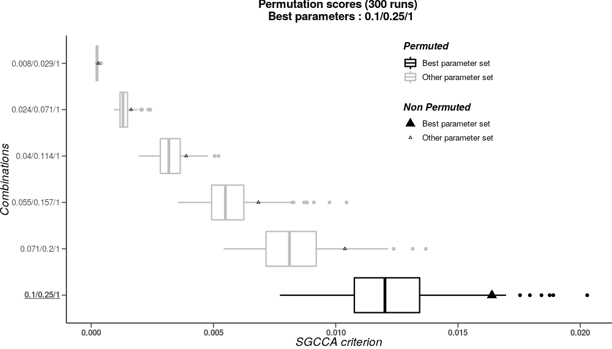
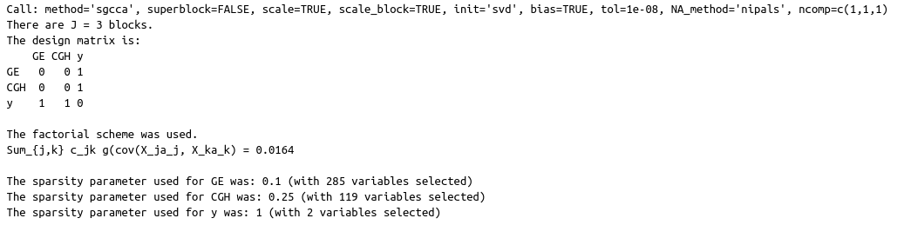
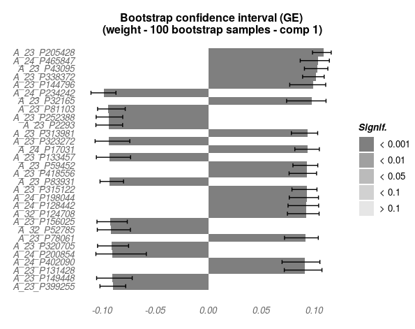
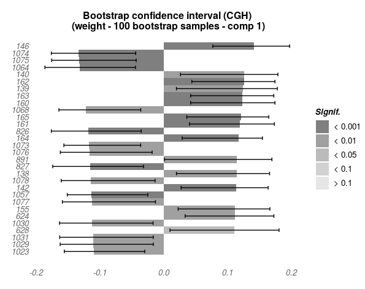
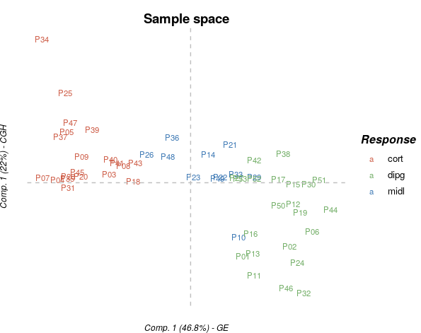

\newcommand{\ma}[1]{\ensuremath{\mathbf{#1}}}
\newcommand{\sign}{\ensuremath{\mathrm{sign}}}
\newcommand{\cov}{\ensuremath{\text{cov}}}
\newcommand{\X}{\mathbf{X}}
\newcommand{\A}{\mathbf{A}}
\newcommand{\Q}{\mathbf{Q}}
\newcommand{\M}{\mathbf{M}}
\newcommand{\mbc}{\mathbf{c}}
\newcommand{\I}{\mathbf{I}}
\newcommand{\mbP}{\mathbf{P}}
\newcommand{\mba}{\mathbf{a}}
\newcommand{\z}{\mathbf{z}}
\newcommand{\w}{\mathbf{w}}
\newcommand{\y}{\mathbf{y}}
\newcommand{\mbb}{\mathbf{b}}
\newcommand{\Xu}{\underline{\mathbf{X}}}
\newcommand{\Pu}{\underline{\mathbf{P}}}
\newcommand{\x}{\mathbf{x}}
\newcommand{\K}{\mathbf{K}}
\newcommand{\mcH}{\mathcal{H}}
\newcommand{\bsx}{\boldsymbol{x}}
\newcommand{\bsxi}{\boldsymbol{\xi}}
\newcommand{\bsa}{\boldsymbol{\alpha}}
\newcommand{\mat}[1]{\textbf{\text{#1}}}

\bibliographystyle{apalike}
\bibliography{biblio}

```{r setup, include=FALSE}
knitr::opts_chunk$set(echo = TRUE, fig.width = 10, fig.height = 10)
```

# Introduction

A challenging problem in multivariate statistics is to study
relationships between several sets of variables measured on the same
set of individuals. In the literature, this paradigm can be stated
under several names as "learning from multimodal data", "data
integration", "data fusion" or "multiblock data analysis".
Typical examples are found in large variety of fields such
as biology, chemistry, sensory analysis, marketing, food research, where
the common general objective is to identify variables of each block
that are active in the relationships with other blocks. For instance,
neuroimaging is increasingly recognised as an intermediate phenotype
to understand the complex path between genetics and behavioural or
clinical phenotypes. In this imaging-genetics context, the goal is
primarily to identify a set of genetic biomarker that explains some
neuroimaging variability which implies some modification of the
behavioural. A second application is found in molecular biology where
the completion of the human genome sequence has shifted
research efforts in genomics toward understanding the effect of
sequence variation on gene expression, protein function, or other
cellular mechanims. Both in the imaging-genetics and the multi-modal
genetic context, it is crucial to perform multiple experiments
(e.g. SNPs, functional MRI, behavioural data) on a single set of
patients and the joint analysis of multiple datasets becomes more and
more crucial. The RGCCA package aims to propose a unified and flexible
framework for that purpose.

# Multiblock data analysis with the RGCCA package

For the sake of comprehension of the use of the RGCCA package, the theoretical fundations of RGCCA and variations - that were previously published [@Tenenhaus2011 ; @Tenenhaus2014 ; @Tenenhaus2015 ; @Tenenhaus2017] - are briefly summarized.

We consider $J$ data matrices $\X_1, \ldots, \X_J$. Each $n \times p_j$ data matrix $\X_j = [\ma x_{j1}, \ldots, \ma x_{jp_j}]$ is called a block and represents a set of $p_j$ variables observed on $n$ individuals. The number and the nature of the variables may differ from one block to another, but the individuals must be the same across blocks. We assume that all variables are centered. The objective of RGCCA is to find, for each block, a weighted composite of variables (called block component) $\y_j= \X_j \ma a_j,j=1, \ldots,J$ (where $\ma a_j$ is a column-vector with  $p_j$ elements) summarizing the relevant information between and within the blocks. The block components are obtained such that (i) block components explain well their own block and/or (ii) block components that are assumed to be connected are highly correlated. In addition, RGCCA integrates a variable selection procedure, called SGCCA, allowing the identification of the most relevant features. Finally, as a component-based method, RGCCA/SGCCA can provide users with graphical representations to visualize the sources of variability within blocks and the amount of correlation between blocks.

## Regularized Generalized Canonical Correlation Analysis

The second generation RGCCA [@Tenenhaus2017] subsumes fifty years of multiblock component methods. It provides important improvements to the initial version of RGCCA [@Tenenhaus2011] and is defined as the following optimization problem:

\begin{equation}
\displaystyle \underset{\ma a_1,\ma a_2, \ldots,\ma a_J}{\text{maximize}} \sum_{j, k = 1}^J c_{jk}g(\mathrm{cov}(\X_j\ma a_j, \X_k\ma a_k)) \mathrm{~~s.t.~~} (1-\tau_j)\mathrm{var}(\X_j\ma a_j) + \tau_j\Vert \ma a_j \Vert^2 = 1, j=1, \ldots,J
\label{optim_RGCCA}
\end{equation}

where:

- The scheme function $g$ is any continuous convex function and allows to consider different optimization criteria.  Typical choices of $g$ are the identity (horst scheme, leading to maximizing the sum of covariances between block components), the absolute value (centroid scheme, yielding maximization of the sum of the absolute values of the covariances), the square function (factorial scheme, thereby maximizing the sum of squared covariances), or, more generally, for any even integer $m$, $g(x) = x^m$  (m-scheme, maximizing the power of $m$ of the sum of covariances). The horst scheme penalizes structural negative correlation between block components while both the centroid scheme and the m-scheme enable two components to be negatively correlated. According to [@VandeGeer1984], a fair model is a model where all blocks contribute equally to the solution in opposition to a model dominated by only a few of the $J$ sets. If fairness is a major objective, the user must choose $m=1$.  $m>1$ is preferable if the user wants to discriminate between blocks. In practice, $m$ is equal to $1$, $2$ or $4$. The higher the value of $m$ the more the method acts as block selector [@Tenenhaus2017].

- The design matrix $\ma C$ is a symmetric  $J \times J$ matrix of nonnegative elements describing the network of connections between blocks that the user wants to take into account. Usually, $c_{jk}=1$ for two connected blocks and 0 otherwise.

-	The $\tau_j$  are called shrinkage parameters ranging from $0$ to $1$ and interpolate smoothly between maximizing the covariance and maximizing the correlation. Setting the $\tau_j$ to 0 will force the block components to unit variance ($\mathrm{var}(\X_j\ma a_j = 1)$), in which case the covariance criterion boils down to the correlation. The correlation criterion is better in explaining the correlated structure across datasets, thus discarding the variance within each individual dataset.  Setting $\tau_j$  to 1 will normalize the block weight vectors ($\ma a_j^\top\ma a_j = 1$ ), which applies the covariance criterion. A value between $0$ and $1$ will lead to a compromise between the two first options and correspond to the following constraint $(1-\tau_j)\mathrm{var}(\X_j\ma a_j) + \tau_j \Vert \ma a_j \Vert^2 = 1$ in (\ref{optim_RGCCA}). The choices $\tau_j = 1$,  $\tau_j = 0$ and  $0<\tau_j<1$ are respectively referred as Modes A, B and Ridge. In the RGCCA package, for each block, the determination of the shrinkage parameter can be made fully automatic by using the analytical formula proposed by [@Schafer2005]. Also, depending on the context, the shrinkage parameters should also be determined based on V-fold cross-validation. We can define the choice of the shrinkage parameters by providing interpretations on the properties of the resulting block components:

    + $\tau_j=1$ yields the maximization of a covariance-based criterion. It is recommended when the user wants a stable component (large variance) while simultaneously taking into account the correlations
between blocks. The user must, however, be aware that variance dominates over correlation.

    + $\tau_j=0$ yields the maximization of a correlation-based criterion. It is recommended when the user wants to maximize correlations between connected components. This option can yield unstable solutions in case of multi-collinearity and cannot be used when a data block is rank deficient (e.g. $n<p_j$).

    +	 $0<\tau_j<1$ is a good compromise between variance and correlation: the block components are simultaneously stable and as well correlated as possible with their connected block components. This setting can be used when the data block is rank deficient.

From optimization problem (\ref{optim_RGCCA}), the term "generalized" in the acronym of RGCCA embraces at least three notions. The first one relates to the generalization of two-block methods - including Canonical Correlation Analysis [@Hotelling1936]  Interbattery Factor Analysis [@Tucker1958] and Redundancy Analysis [@Wollenberg1977] - to three or more sets of variables. The second one relates to the ability of taking into account some hypotheses on between-block connections: the user decides which blocks are connected and which ones are not. The third one relies on the choices of the shrinkage parameters allowing to capture both correlation or covariance-based criteria.

##	Variable selection in RGCCA: Sparse Generalized Canonical Correlation Analysis

The quality and interpretability of the RGCCA block components $\y_j= \X_j \ma a_j,j=1, \ldots,J$ are likely affected by the usefulness and relevance of the variables of each block. Accordingly, it is an important issue to identify within each block a subset of significant variables which are active in the relationships between blocks. SGCCA extends RGCCA to address this issue of variable selection. Specifically, RGCCA with all $\tau_j=1$ equal to 1 is combined with an L1-penalty that gives rise to SGCCA [@Tenenhaus2014b]. The SGCCA optimization problem is defined as follows:

\begin{equation}
\displaystyle \underset{\mba_1,\mba_2, \ldots,\mba_J}{\text{maximize}} \sum_{j, k = 1}^J c_{jk}g(\mathrm{cov}(\X_j\ma a_j, \X_k\ma a_k)) \mathrm{~~s.t.~~} \Vert \mba_j \Vert_2 = 1 \text{~and~} \Vert \mba_j \Vert_1 \le s_j, j=1,\ldots,J
\label{optim_SGCCA}
\end{equation}

where $s_j$ is a user defined positive constant that determines the amount of sparsity for $\ma a_j, j=1, \ldots,J$. The smaller the $s_j$, the larger the degree of sparsity for $\ma a_j$.  The sparsity parameter $s_j$  is usually set based on cross-validation procedures. Alternatively, values of $s_j$ can simply be chosen to result in desired amounts of sparsity.

##	Higher stage block components

It is possible to obtain more than one block-component per block for RGCCA and SGCCA. Higher stage block components can be obtained using a deflation strategy. This strategy forces all the block components within a block to be uncorrelated. This deflation procedure can be iterated in a very flexible way.  It is not necessary to keep all the blocks in the procedure at all stages: the number of components summarizing a block can vary from one block to another (see [@Tenenhaus2017] for details).

## Implementation

The function `rgcca()`of the RGCCA package implements a monotonically convergent algorithm for the optimization problem (\ref{optim_RGCCA}) - i.e. the bounded criterion to be maximized increases at each step of the iterative procedure -, which hits at convergence a stationary point of (\ref{optim_RGCCA}).  Two numerically equivalent approaches for solving the RGCCA optimization problem are available. A primal formulation described in [@Tenenhaus2017 ; @Tenenhaus2011] requires the handling of matrices of dimension $p_j \times p_j$. A dual formulation described in [@Tenenhaus2015] requires the handling of matrices of dimension $n \times n$ . Therefore, the primal formulation of the RGCCA algorithm will be used when $n>p_j$ and the dual form will be preferred when $n\le p_j$ . The `rgcca()` function of the RGCCA package implements these two formulations and selects automatically the best one. The SGCCA algorithm is similar to the RGCCA algorithm and keeps the same convergence properties. The algorithm associated with the optimization problem (2) is available through the function `rgcca()` with the sgcca option (method="sgcca") in the RGCCA package.

##	Special cases of RGCCA

RGCCA is a rich technique that encompasses a large number of multiblock methods that were published for fifty years. These methods are recovered with RGCCA by appropriately defining the triplet ($\ma C$, $\tau_j$, $g$). Table 1 gives the correspondences between the triplet ($\ma C$, $\tau_j$, $g$) and the associated methods. For a complete overview see [@Tenenhaus2017].

|**Methods** |                          $g(x)$ |    $\tau_j$ |                       $\ma C$                      |
|-------------------------------------|----------|---------------------------------------|-------------------------------- |
|**Canonical Correlation Analysis** [@Hotelling1936] |  $x$ | $\tau_1 = \tau_2 = 0$ |$\ma C_1 = \begin{pmatrix}  0 & 1 \\  1 & 0 \end{pmatrix}$ |
|**Interbattery Factor Analysis** [@Tucker1958] |  $x$ | $\tau_1 = \tau_2 = 1$ | $\ma C_1$ |
|**Redundancy Analysis** [@Wollenberg1977] |  $x$ | $\tau_1 = 1$ and $\tau_2 = 0$ | $\ma C_1$  |
|**SUMCOR** [@Horst1961] |  $x$ | $\tau_j = 0, j=1, \ldots, J$ | $\ma C_2 = \begin{pmatrix} 1 & 1 & \cdots &  1 \\ 1 & 1 & \ddots & \vdots \\ \vdots & \ddots& \ddots & 1\\ 1 & \cdots & 1 & 1 \end{pmatrix}$ |
|**SSQCOR** [@Kettenring1971] |  $x^2$ | $\tau_j = 0, 1 \le j \le J$ | $\ma C_2$ |
|**SABSCOR** [@Hanafi2007] |  $|x|$ | $\tau_j = 0, 1 \le j \le J$ | $\ma C_2$ |
|**SUMCOV-1** [@VandeGeer1984] |  $x$ | $\tau_j = 1, 1 \le j \le J$ | $\ma C_2$ |
|**SSQCOV-1** [@Hanafi2006] |  $x^2$ | $\tau_j = 1, 1 \le j \le J$ | $\ma C_2$ |
|**SABSCOV-1** [@Tenenhaus2011 ; @Kramer2007] |  $|x|$ | $\tau_j = 1, 1 \le j \le J$ | $\ma C_2$ |
|**SUMCOV-2** [@VandeGeer1984]  |  $x$ | $\tau_j = 1, 1 \le j \le J$ | $\ma C_3 = \begin{pmatrix} 0 & 1 & \cdots &  1 \\ 1 & 0 & \ddots & \vdots\\ \vdots & \ddots& \ddots& 1\\ 1 & \cdots & 1 & 0 \end{pmatrix}$ |
|**SSQCOV-2** [@Hanafi2006] | $x^2$ | $\tau_j = 1, 1 \le j \le J$ | $\ma C_3$ |
|**Generalized CCA** [@Carroll1968a] |  $x^2$ | $\tau_j = 0, 1 \le j \le J+1$ | $\ma C_4 = \begin{pmatrix} 0 & \cdots &  0 & 1 \\ \vdots & \ddots & \vdots &  \vdots\\ 0 & \cdots & 0 & 1\\ 1 & \cdots & 1 & 0 \end{pmatrix}$ |
|**Generalized CCA** [@Carroll1968b] |  $x^2$ | $\tau_j=0, 0 \leq j \leq J_1 = 0 ~\&~\tau_{J+1} = 0$ and $\tau_j = 1, J_1+1 \leq j \leq J$ | $\ma C_4$ |
|**Hierarchical PCA** [@Wold1996] |  $x^4$ | $\tau_j = 1, 1 \le j \le J$ and $\tau_{J+1} = 0$ | $\ma C_4$ |
|**Multiple Co-Inertia Analysis** [@Chessel1996] |  $x^2$ | $\tau_j = 1, 1 \le j \le J$ and $\tau_{J+1} = 0$ | $\ma C_4$ |
|**PLS path modeling - mode B** [@Wold1982] |  $|x|$ | $\tau_j = 0, 1 \le j \le J$ | $c_{jk}=1$ for two connected block and $c_{jk} = 0$ otherwise |

Table: Special cases of RGCCA in a situtation of $J \ge 2$ blocks. When $\tau_J+1$ is introduced, it is assumed that  $\ma X_1, \ldots, \ma X_J$ are connected to a $(J + 1)$th block defined as the concatenation of the blocks, $\ma X_{J+1} = \bigg[\ma X_1 , \ma X_2, \ldots, \ma X_J \bigg]$ and that $\tau_{J+1}$ corresponds to the shrinkage parameter associated with $\ma X_{J+1}$.

For all the methods of Table 1, a single very simple monotonically convergent gradient-based algorithm is implemented within the RGCCA package and gives at convergence a solution of the stationary equations related to the optimization problem (\ref{optim_RGCCA}). In addition, SGCCA offers a sparse counterpart to all the covariance-based methods of RGCCA. From these perspectives, R/SGCCA provide a general framework for exploratory data analysis of multiblock datasets that has immediate practical consequences for a unified statistical analysis and implementation strategy.

The methods cited in Table 1 are recovered with the `rgcca()` function by appropriately tuning the arguments `connection`, `tau` and `scheme` associated with the triplet ($\ma C$, $\tau_j$, $g$). All the methods of Table 1 are obtained as follows:

### Principal Component Analysis.

Principal Component Analysis is defined as the following optimization problem

\begin{equation}
\underset{\ma a}{\text{maximize}} \text{~~var}\left(\X \ma a \right) \mathrm{~s.t.~} \Vert \ma a \Vert = 1
\label{PCA1}
\end{equation}

and is obtained with the `rgcca()` function as follows:

```{r, eval = FALSE}
fit.pca = rgcca(blocks = list(X, X),
                connection = matrix(c(0, 1, 1, 0), 2, 2),
                tau = c(1, 1))
```
or
```{r, eval = FALSE}
fit.pca = rgcca(blocks = list(X), method="pca")
```

### Canonical Correlation Analysis

Canonical Correlation Analysis is defined as the following optimization problem

\begin{equation}
\underset{\ma a_1, \ma a_2}{\text{maximize}} \text{
~~cor}\left(\X_1\ma a_1, \X_2\ma a_2 \right) \mathrm{~s.t.~} \text{var}(\X_1\ma a_1) = \text{var}(\X_2\ma a_2) = 1
\label{CCA}
\end{equation}

and is obtained with the `rgcca()` function as follows:


```{r, eval = FALSE}
fit.cca = rgcca(blocks= list(X1, X2),
                connection = matrix(c(0, 1, 1, 0), 2, 2),
                tau = c(0, 0))
```

or

```{r, eval = FALSE}
fit.cca = rgcca(blocks= list(X1, X2), method="cca")
```

### PLS regression ($\approx$ Interbattery factor analysis)

PLS regression is defined as the following optimization problem

\begin{equation}
\underset{\ma a_1, \ma a_2}{\text{maximize}} \text{
~~cov}\left(\X_1\ma a_1, \X_2\ma a_2 \right) \mathrm{~s.t.~} \Vert \ma a_1 \Vert = \Vert \ma a_2 \Vert = 1
\label{PLS}
\end{equation}

and is obtained with the `rgcca()` function as follows:


```{r, eval = FALSE}
fit.pls = rgcca(blocks= list(X1, X2),
                connection= matrix(c(0, 1, 1, 0), 2, 2),
                tau = c(1, 1))
```

or

```{r, eval = FALSE}
fit.pls = rgcca(blocks= list(X1, X2), method="pls")
```


### Redundancy Analysis of $\X_1$ with respect to $\X_2$

Redundancy Analysis of $\X_1$ with respect to $\X_2$ is defined as the following optimization problem

\begin{equation}
\underset{\ma a_1, \ma a_2}{\text{maximize}} \text{
~~cor}\left(\X_1 \ma a_1, \X_2 \ma a_2 \right) \times \text{
var}\left(\X_1\ma a_1\right)^{1/2} \mathrm{~s.t.~} \Vert \ma a_1 \Vert = \text{var}(\X_2\ma a_2) = 1
\label{RA}
\end{equation}

and is obtained with the `rgcca()` function as follows:

```{r, eval = FALSE}
fit.ra = rgcca(blocks= list(X1, X2),
               connection = matrix(c(0, 1, 1, 0), 2, 2),
               tau = c(1, 0))
```

### Regularized Canonical Correlation Analysis [@Vinod1976 ; @Shawe2004]

Regularized Canonical Correlation Analysis is defined as the following optimization problem

\begin{equation}
\underset{\ma a_1, \ma a_2}{\text{maximize}} \text{
~~cov}\left(\X_1\ma a_1, \X_2\ma a_2 \right) \mathrm{~s.t.~} \tau_j
\Vert \ma a_j \Vert^2 + (1-\tau_j)\text{var}(\X_j\ma a_j) = 1, j =1,2
\label{rCCA}
\end{equation}

and is obtained with the `rgcca()` function as follows:

```{r, eval = FALSE}
fit.rcca = rgcca(blocks= list(X1, X2),
                 connection = matrix(c(0, 1, 1, 0), 2, 2),
                 tau = c(0<tau1<1, 0<tau2<1))
```

For various extreme cases $\tau_1 = 0$ or $1$ and $\tau_2 = 0$ or $1$, optimization problem (\ref{rCCA}) covers a situation which goes from Tucker's interbattery factor
analysis to Canonical Correlation Analysis while passing through redundancy analysis.
This framework corresponds exactly to the one proposed by [@Borga1997] and [@Burnham1996]. Moreover, the special situation where $0 \le \tau_1 \le 1$ and $\tau_2 = 0$ which corresponds to a regularized version of redundancy analysis has been studied by
[@Takane2007] and by [@Bougeard2008] under the name "Continuum
redundancy-PLS regression". When one block is reduced to only one variable,
optimization problem (\ref{rCCA}) is equivalent to the simple continuum
regression approach proposed by [@Qannari2005].

### SUMCOV-1

SUMCOV-1 is defined as the following optimization problem

\begin{equation}
\underset{\ma a_1, \ma a_2, \ldots,\ma a_J} {\text{maximize}} \displaystyle \sum_{j, k = 1}^J \text{cov}(\ma X_j\ma a_j, \ma X_k\ma a_k) \text{~~s.t~~} \Vert \ma a_j \Vert = 1, j=1, \ldots, J
\end{equation}

and is obtained with the `rgcca()` function as follows:

```{r, eval = FALSE}
# X1 = Block1, ..., XJ = BlockJ
# J*J Design matrix -> connection
# Shrinkage parameters -> tau = c(tau1, ...,  tauJ)

fit.sumcov = rgcca(blocks= list(X1, ..., XJ),
                   connection = matrix(1, J, J),
                   tau = rep(1, J),
                   scheme = "horst")
```

or

```{r, eval = FALSE}
fit.sumcov = rgcca(blocks= list(X1, ..., XJ), method="sumcov-1")
```

### SSQCOV-1

SSQCOV-1 is defined as the following optimization problem

\begin{equation}
\underset{\ma a_1, \ma a_2, \ldots,\ma a_J} {\text{maximize}} \displaystyle \sum_{j, k = 1}^J \text{cov}^2(\ma X_j\ma a_j, \ma X_k\ma a_k) \text{~~s.t~~} \Vert \ma a_j \Vert = 1, j=1, \ldots, J
\end{equation}

and is obtained with the `rgcca()` function as follows:

```{r, eval = FALSE}
fit.ssqcov = rgcca(blocks= list(X1, ..., XJ),
                   connection = matrix(1, J, J),
                   tau = rep(1, J),
                   scheme = "factorial")
```

or

```{r, eval = FALSE}
fit.ssqcov = rgcca(blocks= list(X1, ..., XJ), method="ssqcov")
```

### SABSCOV

SABSCOV is defined as the following optimization problem

\begin{equation}
\underset{\ma a_1, \ma a_2, \ldots,\ma a_J} {\text{maximize}} \displaystyle \sum_{j, k = 1}^J \vert \text{cov}(\ma X_j\ma a_j, \ma X_k\ma a_k) \vert \text{~~s.t~~} \Vert \ma a_j \Vert = 1, j=1, \ldots, J
\end{equation}

and is obtained with the `rgcca()` function as follows:

```{r, eval = FALSE}
fit.sabscov = rgcca(blocks= list(X1, ..., XJ),
                    connection = matrix(1, J, J),
                    tau = rep(1, J),
                    scheme = "centroid")
```

or

```{r, eval = FALSE}
fit.sabscov = rgcca(blocks= list(X1, ..., XJ), method="sabscov")
```

### SUMCOR

SUMCOR is defined as the following optimization problem

\begin{equation}
\underset{\ma a_1, \ma a_2, \ldots,\ma a_J} {\text{maximize}} \displaystyle \sum_{j, k = 1}^J \text{cor}(\ma X_j\ma a_j, \ma X_k\ma a_k) \text{~~s.t~~} \text{var}(\X_j \ma a_j) = 1, j=1, \ldots, J
\end{equation}

and is obtained with the `rgcca()` function as follows:

```{r, eval = FALSE}
fit.sumcor = rgcca(blocks= list(X1, ..., XJ),
                   connection = matrix(1, J, J),
                   tau = rep(0, J),
                   scheme = "horst")
```

or

```{r, eval = FALSE}
fit.sumcor = rgcca(blocks= list(X1, ..., XJ), method="sumcor")
```

### SSQCOR

SSQCOR is defined as the following optimization problem

\begin{equation}
\underset{\ma a_1, \ma a_2, \ldots,\ma a_J} {\text{maximize}} \displaystyle \sum_{j, k = 1; k \ne j}^J  \text{cor}^2(\ma X_j\ma a_j, \ma X_k\ma a_k) \text{~~s.t~~} \text{var}(\X_j \ma a_j) = 1, j=1, \ldots, J
\end{equation}

and is obtained with the `rgcca()` function as follows:

```{r, eval = FALSE}
fit.ssqcor = rgcca(blocks= list(X1, ..., XJ),
                   connection = matrix(1, J, J),
                   tau = rep(0, J),
                   scheme = "factorial")
```

or

```{r, eval = FALSE}
fit.ssqcor = rgcca(blocks= list(X1, ..., XJ), method="ssqcor")
```

### SABSCOR

SABSCOR is defined as the following optimization problem

\begin{equation}
\underset{\ma a_1, \ma a_2, \ldots,\ma a_J} {\text{maximize}} \displaystyle \sum_{j, k = 1}^J \vert \text{cor}(\ma X_j\ma a_j, \ma X_k\ma a_k) \vert \text{~~s.t~~} \text{var}(\X_j \ma a_j) = 1, j=1, \ldots, J
\end{equation}

and is obtained with the `rgcca()` function as follows:


```{r, eval = FALSE}
fit.sabscor = rgcca(blocks= list(X1, ..., XJ),
                    connection = matrix(1, J, J),
                    tau = rep(0, J),
                    scheme = "centroid")
```

or

```{r, eval = FALSE}
fit.sabscor = rgcca(blocks= list(X1, ..., XJ), method="sabscor")
```

### SUMCOV-2

SUMCOV-2 is obtained from following optimization problem

\begin{equation}
\underset{\ma a_1, \ma a_2, \ldots,\ma a_J} {\text{maximize}} \displaystyle \sum_{j, k = 1 ; j \ne k}^J  \text{cov}(\ma X_j\ma a_j, \ma X_k\ma a_k) \text{~~s.t~~} \Vert \ma a_j \Vert = 1, j=1, \ldots, J
\end{equation}

and is obtained with the `rgcca()` function as follows:

```{r, eval = FALSE}
C = matrix(1, J, J) ; diag(C) = 0
fit.sumcov2 = rgcca(blocks= list(X1, ..., XJ),
                   connection = C,
                   tau = rep(1, J),
                   scheme = "horst")
```

or

```{r, eval = FALSE}
fit.sumcov2 = rgcca(blocks= list(X1, ..., XJ), method="sumcov-2")
```

### SSQCOV-2

SSQCOV-2 is obtained from following optimization problem

\begin{equation}
\underset{\ma a_1, \ma a_2, \ldots,\ma a_J} {\text{maximize}} \displaystyle \sum_{j, k = 1; j \ne k}^J \text{cov}^2(\ma X_j\ma a_j, \ma X_k\ma a_k) \text{~~s.t~~} \Vert \ma a_j \Vert = 1, j=1, \ldots, J
\end{equation}

and is obtained with the `rgcca()` function as follows:

```{r, eval = FALSE}
C = matrix(1, J, J) ; diag(C) = 0
fit.ssqcov2 = rgcca(blocks= list(X1, ..., XJ),
                    connection = C,
                    tau = rep(1, J),
                    scheme = "factorial")
```

or

```{r, eval = FALSE}
fit.ssqcov2 = rgcca(blocks= list(X1, ..., XJ), method= "ssqcov-2")
```

### Generalized CCA [@Carroll1968a]

For Carroll's Generalized Canonical Correlation Analysis (GCCA), a superblock $\ma X_{J+1} = \left[\ma X_1, \dots, \ma X_J \right]$ defined as the concatenation of all the blocks is introduced. GCCA is defined as the following optimization problem
\begin{equation}
\underset{\ma a_1, \ma a_2, \ldots,\ma a_J} {\text{maximize}} \displaystyle \sum_{j=1}^J \text{cor}^2(\ma X_j\ma a_j, \ma X_{J+1}\ma a_{J+1}) \text{~~s.t~~} \text{var}(\X_j \ma a_j) = 1, j=1, \ldots, J+1
\end{equation}

and is obtained with the `rgcca()` function as follows:
```{r, eval = FALSE}
# X1 = Block1, ..., XJ = BlockJ, X_{J+1} = [X1, ..., XJ]
# with superblock = TRUE, the implicit (J+1)*(J+1) Design matrix C is defined as :
#C = matrix(c(0, 0, 0, ..., 0, 1,
#             0, 0, 0, ..., 0, 1,
#             0, 0, 0, ..., 0, 1,
#                  ...
#             1, 1, 1, ..., 1, 0), J+1, J+1)

fit.gcca = rgcca(blocks= list(X1, ..., XJ),
                 superblock=TRUE,
                 tau = rep(0, J+1),
                 scheme = "factorial")
```

or

```{r, eval = FALSE}
fit.gcca = rgcca(blocks= list(X1, ..., XJ), method = "gcca")
```

### Multiple Co-Inertia Analysis

For Multiple Co-Inertia Analysis (MCOA) a superblock $\ma X_{J+1} = [\ma X_1, \dots, \ma X_J$ defined as the concatenation of all the blocks is introduced. MCOA is defined as the following optimization problem

\begin{equation}
\underset{\ma a_1, \ma a_2, \ldots,\ma a_J} {\text{maximize}} \displaystyle \sum_{j=1}^J \text{cor}^2(\ma X_j\ma a_j, \ma X_{J+1}\ma a_{J+1})\times \text{var}(\X_j\ma a_j), \text{~~s.t~~} \Vert \ma a_j \Vert = 1, j=1, \ldots, J \text{~~and~~} \text{var}(\X_{J+1}\ma a_{J+1}) = 1
\end{equation}

and is obtained with the `rgcca()` function as follows:


```{r, eval = FALSE}
fit.mcoa = rgcca(blocks= list(X1, ..., XJ),
                       superblock=TRUE,
                       tau = c(rep(1, J), 0),
                       scheme = "factorial")
```

### Hierarchical Principal Component Analysis

For Hierarchical Principal Component Analysis (HPCA), a superblock $\ma X_{J+1} = [\ma X_1, \dots, \ma X_J]$ defined as the concatenation of all the blocks is introduced. HPCA is defined as the following optimization problem

\begin{equation}
\underset{\ma a_1, \ma a_2, \ldots,\ma a_J} {\text{maximize}} \displaystyle \sum_{j=1}^J \text{cov}^4(\ma X_j\ma a_j, \ma X_{J+1}\ma a_{J+1}), \text{~~s.t~~} \Vert \ma a_j \Vert = 1, j=1, \ldots, J \text{~~and~~} \text{var}(\X_{J+1}\ma a_{J+1}) = 1
\end{equation}

and is obtained with the `rgcca()` function as follows:

```{r, eval = FALSE}
fit.hpca = rgcca(blocks= list(X1, ..., XJ)
                       superblock=TRUE,
                       tau = c(rep(1, J), 0),
                       #flexible design of the scheme function
                       scheme = function(x) x^4)
```

### Principal Component Analysis (alternative formulation)

Let $\ma X =[\ma x_1, \ldots, \ma x_p]$ be a $n \times p$ data matrix. PCA can be defined as the following optimization problem

\begin{equation}
\underset{\ma a}{\text{maximize}} \displaystyle \sum_{j=1}^p \text{cor}^2(\ma x_{j}, \ma X \ma a) \text{~~s.t~~} \text{var}(\ma X \ma a)=1
\end{equation}

and is obtained with the `rgcca()` function as follows:

```{r, eval = FALSE}
# one block X = [x1, ..., xJ] with J variables x1, ..., xJ
# (J+1)*(J+1) Design matrix C
C = matrix(c(0, 0, 0, ..., 0, 1,
             0, 0, 0, ..., 0, 1,
             0, 0, 0, ..., 0, 1,
                  ...
             1, 1, 1, ..., 1, 0), J+1, J+1)
# Shrinkage parameters tau = c(tau1, ...,  tauJ, tau_{J+1})
fit.pca = rgcca(list(x1, ..., xJ),
                tau = c(rep(0, J+1), 0),
                superblock=TRUE,
                #flexible design of the scheme function
                scheme = function(x) x^2)
```

# Practical session

## RGCCA for the Russett dataset.

In this section, we propose to reproduce some of the results presented in [@Tenenhaus2011] for the Russett data. The Russett dataset is available within the RGCCA package. The Russett data set [@Russett1964] are studied in [@Gifi1990]. Russett collected this data to study relationships between Agricultural Inequality, Industrial Development and Political Instability.

```{r}
library(RGCCA)
data(Russett)
head(Russett)
```

The first step of the analysis is to define the blocks. Three blocks of variables have been defined for 47 countries. The variables that compose each block have been defined according to the nature of the variables.

- The first block $\X_1$ = [GINI, FARM, RENT] is related to "Agricultural Inequality":
    + GINI = Inequality of land distribution,
    + FARM = \% farmers that own half of the land (> 50),
    + RENT = \% farmers that rent all their land.

- The second block $\X_2$ = [GNPR, LABO] describes "Industrial Development":
    + GNPR = Gross national product per capita ($1955),
    + LABO = % of labor force employed in agriculture.

- The third one $\X_3$ = [INST, ECKS, DEAT] measures "Political Instability":
    + INST = Instability of executive (45-61),
    + ECKS = Number of violent internal war incidents (46-61),
    + DEAT = Number of people killed as a result of civic group violence (50-62).
    + An additional variable DEMO describes the political regime: stable democracy, unstable democracy or dictatorship. The dummy variable "unstable democracy" has been left out because of redundancy.

The different blocks of variables $\ma X_1, \ldots, \ma X_J$ are arranged in the list format.

```{r}
X_agric = as.matrix(Russett[,c("gini","farm","rent")])
X_ind = as.matrix(Russett[,c("gnpr","labo")])
X_polit = as.matrix(Russett[ , c("inst", "ecks",  "death",
                                 "demostab", "dictator")])
A = list(Agric = X_agric, Ind = X_ind, Polit = X_polit)

sapply(A, head)
```

**Preprocessing** In order to ensure comparability between variables standardization is applied (zero mean and unit variance). Such a preprocessing is reached by setting the `scale` argument to `TRUE` (default value) in the `rgcca()` function.

To make blocks comparable, a possible strategy is to standardize the variables and then to divide each block by the square root of its number of variables [@Westerhuis1998]. This two-step procedure leads to $\mathrm{tr}(\ma X_j^\top \ma X_j )=n$  for each block (i.e. the sum of the eigenvalues of the covariance matrix of $\ma X_j$ is equal to $1$ whatever the block). Such a preprocessing is reached by setting the `scale_block` argument to `TRUE` (default value) in the `rgcca()` function.

**Definition of the design matrix $\mathbf{C}$.** From Russett's hypotheses, it is difficult for a country to escape dictatorship when its agricultural inequality is above-average and its industrial development below-average. These hypotheses on the relationships between blocks are depicted in Figure \ref{fig:C}.

\begin{figure}[!!!h]
\centering
\begin{tikzpicture}
\tikzstyle{every node}=[draw,shape=circle,auto,node distance=3.5cm];
\node (Polit) {Polit};
\node (Agric) [below left of=Polit] {Agric};
\node (Indust) [above left of=Polit] {Indust};
\draw (Agric) -- (Polit)
(Indust) -- (Polit);
\end{tikzpicture}
\caption{between-block connection.}
\label{fig:C}
\end{figure}

and encoded through the design matrix $\mathbf{C}$; usually $c_{jk} = 1$ for two connected blocks and $0$ otherwise. Therefore, we have decided to connect Agricultural Inequality to Political Instability ($c_{13} = 1$), Industrial Development to Political Instability ($c_{23} = 1$) and to not connect Agricultural Inequality to Industrial Development ($c_{12} = 0$). The resulting design matrix $\ma C$ is:

```{r}
#Define the design matrix C.
C = matrix(c(0, 0, 1,
             0, 0, 1,
             1, 1, 0), 3, 3)

C
```

RGCCA using the pre-defined design matrix $\ma C$, the factorial scheme ($g(x) = x^2$) and mode B for all blocks (full correlation criterion) is obtained by specifying appropriately the `connection`, `scheme` and `tau` arguments of the `rgcca()` function. The `verbose` argument (default value = `TRUE`) indicates that the progress will be reported while computing and that a plot representing the convergence of the algorithm will be returned.

```{r, fig.height = 3, fig.width = 5}
rgcca_B_factorial = rgcca(blocks = A, connection = C,
                          tau = rep(0, 3),
                          scheme = "factorial",
                          scale = TRUE,
                          scale_block = FALSE,
                          verbose = TRUE)
```

the print() function allows summarizing the RGCCA analysis

```{r}
print(rgcca_B_factorial)
```

The weight vectors solution of the optimization problem (\ref{optim_RGCCA}) are available as output of the `rgcca()` function in `a` and reported below:

```{r}
rgcca_B_factorial$a # weight vectors
```

and correspond exactly to the weight vectors reported in [@Tenenhaus2011, see Figure 4].

The block weight vectors can also be visualized using the generic `plot()` function.

```{r}
plot(rgcca_B_factorial, type = "weight", block = 1)
```
The block-loading vectors defined as the correlation between the variables of one block and its own block components can be also vizualized.

```{r}
plot(rgcca_B_factorial, type = "loadings", block = 1)
```

**Assessment of the reliability of parameter estimates.** It is possible to use
a bootstrap resampling method to assess the reliability of parameter estimates
(block-weight/loading vectors) obtained using RGCCA. $B$ bootstrap samples of 
the same size as the original data is repeatedly sampled with replacement from 
the original data. RGCCA is then applied to each bootstrap sample to obtain the 
RGCCA estimates. We calculate the standard deviation of the estimates across the 
bootstrap samples, from which we derived, bootstrap confidence intervals, 
t-ratio (defined as the ratio of the parameter estimate to its bootstrap-based 
standard deviation) and p-value (the p-value is computed by assuming that the 
ratio of the parameter estimate to its standard deviation follows the 
standardized normal distribution) to indicate how reliably parameters were 
estimated. Since several p-values are constructed simultaneously, FDR correction 
can be applied for controlling the False Discovery Rate. This function is 
available using the `bootstrap()` function of the RGCCA package.

```{r}
boot.out = bootstrap(rgcca_B_factorial, 
                     n_boot = 20, n_cores = 1)
```
The bootstrap results are displayed using the `plot()`function.

```{r}
plot(boot.out, type = "loadings", empirical = TRUE, block = 1)
```

and detailed using the `print()` function.

```{r}
print(boot.out)
```


The block components are also available as output of the `rgcca()` function. The first components of each block are given by:

```{r}
Y = rgcca_B_factorial$Y
lapply(Y, head)
```

and can be cross-visualized using the generic `plot()` function (see below).

At last, as a component-based method, RGCCA provides the users with graphical representations, including factor plot, correlation circle. This graphical displays allows visualizing the sources of variability within blocks, the relationships between variables within and between blocks and the amount of correlation between blocks. The graphical display of the countries obtained by crossing $\ma X_1 \ma a_1$ = Agricultural Inequality and $\ma X_2 \ma a_2$ = Industrial Development and marked with their political regime in 1960 is shown in below.

```{r, eval=TRUE, fig.align='center', fig.cap = 'graphical display of the countries obtained by crossing y1 and y2 and labeled according to their political regime',fig.height = 6, fig.width = 8}

lab = factor(apply(Russett[, 9:11], 1, which.max),
             labels = c("Stable democracy", "Unstable democracy", "Dictatorship"))

plot(rgcca_B_factorial, type = "sample",
     block = 1:2, comp = 1,
     resp = lab, overlap = FALSE)
```

Countries aggregate together when they share similarities. It may be noted that the lower left quadrant concentrates on dictatorships. It is difficult for a country to escape dictatorship when its industrial development is below-average and its agricultural inequality is above average. It is worth pointing out that some unstable democracies located in this quadrant (or close to it) became dictatorships for a period of time after 1960: Greece (1967-1974), Brazil (1964-1985), Chili (1973-1990), and Argentina (1966-1973). The Average Variance Explained (AVE) of block $\ma X_j$ for a specific block component $\ma y_j$ is defined as:

\begin{equation}
\mathrm{AVE}(\ma X_j)=  1/p_j \sum_{h=1}^{p_j} cor^2( \ma x_{jh},\ma y_j)
\end{equation}

AVE($\ma X_j$) varies between 0 and 1 and reflects the proportion of variance captured by $\ma y_j$.

Additional indicators of model quality are proposed:

- For all blocks:

\begin{equation}
\displaystyle \mathrm{AVE(outer model)} = \left( 1/\sum_j p_j \right) \sum_j p_j \mathrm{AVE}(\ma X_j)
\end{equation}

- For the inner model:

\begin{equation}
\displaystyle \mathrm{AVE(inner model)} = \left( 1/\sum_{j<k} c_{jk} \right) \sum_{j<k} c_{jk} \mathrm{cor}^2(\ma y_j , \ma y_k)
\end{equation}

These indicators of model quality can be obtained as follows:

```{r}
rgcca_B_factorial$AVE
```

and corresponds exactly to the results reported in [@Tenenhaus2011, see last column of Table 7].

The AVEs outer can also be visualized using the generic `plot()` function.

```{r, eval = FALSE, fig.align='center', fig.cap = 'Average variance explained of the various blocks', fig.height = 5, fig.width = 8}
plot(rgcca_B_factorial, type = "ave")
```

## Choice of the shrinkage parameter $\tau$

Three fully automatic strategies are proposed to select the optimal shrinkage parameters as described below:

**Choice of the shrinkage parameter using the Schafer and Strimmer analytical formula [@Schafer2005]**
For each block $j$, an "optimal" shrinkage parameter $\tau_j$ can be obtained
from the Schafer and Strimmer analytical formula [@Schafer2005] by using the
`tau = "optimal"` argument of the `rgcca()` function:

```{r}
rgcca_optimal_factorial = rgcca(blocks=A, connection=C, tau = "optimal",
                                scheme = "factorial", scale = TRUE,
                                verbose = FALSE)
```

The optimal shrinkage parameters are given by:

```{r}
rgcca_optimal_factorial$call$tau
```

This automatic estimation of the shrinkage parameters allows one to come closer
to the correlation criterion, even in the case of high multicollinearity or when
the number of individuals is smaller than the number of variables.

As previoulsy, this model can be bootstraped using the bootstrap function.

```{r}
boot_opt = bootstrap(rgcca_optimal_factorial, 
                     n_boot = 20, n_cores = 1)
```

The bootstrap confidence are given below for the third block:

```{r}
plot(boot_opt, type = "loadings", block = 1)
```

**Choice of the shrinkage parameter using a permutation based strategy.**
A permutation based strategy very similar to the one proposed in [@Witten2009a]
has been also integrated within the RGCCA package through the
`rgcca_permutation()` function. This function is used to select automatically
the regularization parameters for R/SGCCA.

For each set of regularization parameters (generally this will be a
$J$-dimensional vector), repeat the following `n_perm` times, for
(`n_perm` large):

\begin{enumerate}
\item [\label{p1}] The samples in $\mathbf X_1, \ldots, \mathbf X_J$ are
randomly permuted to obtained data sets $\mathbf X_1^*, \ldots, \mathbf X_J^*$.
%
\item [\label{p2}] S/RGCCA is run on the permuted data set
$\mathbf X_1^*, \ldots, \mathbf X_J^*$ to get block weight vectors
$\mathbf w_1^*, \ldots, \mathbf w_J^*$.
%
\item [\label{p3}]  Record $t^* = \displaystyle \sum_{j,k} c_{jk} g(\text{cov}(\mathbf X_j^*\mathbf w_j^*, \mathbf X_k^*\mathbf w_k^*))$.
%
\item [\label{p4}]  S/RGCCA is run on the original data
$\mathbf X_1, \ldots, \mathbf X_J$ to obtain the block weight vectors
$\mathbf w_1, \ldots, \mathbf w_J$.
%
\item [\label{p5}]  Record $t = \displaystyle \sum_{j,k} c_{jk} g(\text{cov}(\mathbf X_j\mathbf w_j, \mathbf X_k\mathbf w_k))$.
%
\item [\label{p6}]  The resulting p-value is given by the fraction of permuted
$t*$ that exceed the real $t$t obtained from the real data.
\end{enumerate}

Then choose the set of tuning parameters that gives the smallest value in step
(\ref{p6}).

This procedure is available though the `rgcca_permutation()` function.

```{r}
set.seed(123)
fit.perm = rgcca_permutation(A, connection = C,
                             par_type = "tau", n_cores = 1,
                             n_perms = 5)
```

By default, the `rgcca_permutation()` function takes, for each block, 10 sets 
of tuning parameters between min values (0 for RGCCA and $1/sqrt(ncol)$ for 
SGCCA) and 1.

Results of the permutation procedure are summarized using the generic `print()` 
function

```{r}
print(fit.perm)
```

and displayed using the `plot()` function.

```{r}
plot(fit.perm)
```

The optimal model can be bootstrapped as follows:

```{r}
fit.opt_perm = rgcca(fit.perm)
boot_perm = bootstrap(fit.opt_perm, n_boot = 20, n_cores = 1)
```

and displayed as usual: 

```{r}
plot(boot_perm, type = "weight")
```

It is possible to define explicitly the combination of regularization paramaters.
In that case a matrix of dimension $K \times J$ is required. Each row of this 
matrix corresponds to one set of tuning parameters.

```{r}
fit.perm = rgcca_permutation(A, connection = C,
                             par_type = "tau",
                             par_value = rbind(rep(1, 3),
                                               seq(0, 1, l=3),
                                               rep(0, 3),
                                               sapply(A, RGCCA:::tau.estimate)),
                             n_cores = 1, n_perms = 5)
```

Alternatively a numeric vector of length $J$ indicating the range of values to 
be tested: from the minimum values (0 for RGCCA and $1/sqrt(ncol)$ for SGCCA) 
to the maximum values specified by the user with `par_value`.

```{r}
fit.perm = rgcca_permutation(A, connection = C,
                             par_type = "tau",
                             par_value = seq(0, 1, l=3),
                             n_cores = 1, n_perms = 5)
```

If `par_type = sparsity`, the `rgcca_permutation()` function switches 
automatically to `sgcca()`. The same rational is used for the other arguments 
of the function.

```{r}
set.seed(10)
fit.perm = rgcca_permutation(A, connection = C,
                             par_type = "sparsity",
                             method = "sgcca",
                             n_cores = 1, n_perms = 5)
fit.perm$bestpenalties
```

A bootstrap analysis also applies to sparse model. In that case, only the selected 
variables are embedded in the bootstrap procecure. 

```{r}
fit.opt = rgcca(fit.perm)
boot_out = bootstrap(fit.opt, n_boot = 20, n_cores = 1,
                     verbose = FALSE)
```

It is useful (especially in high dimensional settings) to stabilize the variable 
selection procedure using the `rgcca_stability()` function. The amount of sparsity 
is set using the `keep` argument.

```{r, eval = TRUE}
fit.opt = rgcca(fit.perm)
fit.stab = rgcca_stability(fit.opt, 
                           keep = sapply(fit.opt$a, 
                                         function(x) mean(x!=0)),
                           n_boot = 5,
                           n_cores = 1
                           )
```

and then apply the bootstrap procedure for confidence intervals and other 
statistics on the block weight/loadings vectors.

```{r, eval = FALSE}
boot.out = bootstrap(fit.stab)
```

The bootstrap results can be summarized using the `get_bootstrap()` function

```{r}
get_bootstrap(boot.out, type = "weight", 
             empirical  = TRUE, display_order = FALSE, block = 3)
```

and visualized using the generic `plot()` function.

```{r, eval = FALSE}
plot(boot.out, block = 3)
```

```{r, eval = FALSE}
plot(boot.out, block = 2)
```

All the details are reported with the `print()` function.

```{r}
print(boot.out)
```

**RGCCA with superblock** In the framework of consensus/hierarchical methods,
a superblock defined as the concatenation of all the blocks is introdued. 
In that framework, global components can be derived. The space spanned by the 
global components is viewed as a consensus space that integrated all the 
modalities and facilitates the visualization of the results and their interpretation.

In this section, we consider Multiple Co-Inertia Analysis with $2$ components 
per block. The number of components is specified using the `ncomp = rep(2, 4)` 
argument (default value `ncomp = rep(1, length(A))`, which gives one component per block).

```{r}
fit.mcoa = rgcca(blocks=A, method = "mcoa", ncomp = 2)
print(fit.mcoa)
```

or alternatively using the `superblock` argument:

```{r, eval = FALSE}
X_agric =as.matrix(Russett[,c("gini","farm","rent")])
X_ind = as.matrix(Russett[,c("gnpr","labo")])
X_polit = as.matrix(Russett[ , c("inst", "ecks",  "death")])
A = list(Agric = X_agric, Ind = X_ind, Polit = X_polit)

fit.mcoa = rgcca(blocks = A, tau = c(1, 1, 1, 0),
                verbose = FALSE, ncomp = rep(2, 4),
                #flexible design of the scheme function
                scheme = function(x) x^2,
                scale = TRUE, superblock = TRUE)
```

Multiple Co-Inertiea Analysis(MCOA) enables the countries to be represented in 
the space spanned by the two first global components. Despite some overlap, 
the first global component exhibits a separation/continuum among regimes.

```{r, fig.align='center', fig.cap = 'graphical display of the countries obtained by crossing the two first components of the superblock and labeled according to their political regime',fig.height = 6, fig.width = 8}
plot(fit.mcoa, resp=lab, type = "sample", overlap = FALSE)
```

Moreover, the correlation circle highlights the contribution of each variable 
to the construction of the global components. This figure shows the original 
variables projected on the compromise space.

```{r, fig.align='center', fig.cap = 'graphical display of the correlation cicle associated with the two first components of the superblock. Each variable are colored according to their block membership',fig.height = 6, fig.width = 8}
plot(fit.mcoa, type = "corCircle")
```

A variable that is highly expressed for a category of individuals is projected 
with a high weight (far from the origin) in the direction of that category.

It is often useful to visualize jointly the sample space and the correlation 
circle. This is make possible by using the `type = "both"` argument of the 
plot function.

```{r, fig.align='center', fig.cap = 'sample space and correlation cirle',fig.height = 6, fig.width = 8}
plot(fit.mcoa, type = "both", resp = lab, overlap = FALSE)
```

## RGCCA (dual formulation) for the Glioma dataset

**Biological problem.** Brain tumors are the most common solid tumors in 
children and have the highest mortality rate of all pediatric cancers. Despite 
advances in multimodality therapy, children with pHGG invariably have an overall 
survival of around 20\% at 5 years. Depending on their location (e.g. brainstem, 
central nuclei, or supratentorial), pHGG present different characteristics in 
terms of radiological appearance, histology, and prognosis. Our hypothesis is 
that pHGG have different genetic origins and oncogenic pathways depending on 
their location. Thus, the biological processes involved in the development of 
the tumor may be different from one location to another, as it has been 
frequently suggested.

**Description of the data.** Pretreatment frozen tumor samples were obtained 
from 53 children with newly diagnosed pHGG from Necker Enfants Malades (Paris, 
France) [@Puget2012]. The 53 tumors are divided into 3 locations: supratentorial 
(HEMI), central nuclei (MIDL), and brain stem (DIPG). The final dataset is 
organized in 3 blocks of variables defined for the 53 tumors: the first block 
$\ma X_1$ provides the expression of $15702$ genes (GE). The second block 
$\ma X_2$ contains the imbalances of $1229$ segments (CGH) of chromosomes. 
$\ma X_3$ is a block of dummy variables describing the categorical variable 
location. One dummy variable has been left out because of redundancy with he 
others.

```{r, eval = FALSE}
# Download the dataset's package at http://biodev.cea.fr/sgcca/.
# --> gliomaData_0.4.tar.gz

require(gliomaData)
data(ge_cgh_locIGR)

A <- ge_cgh_locIGR$multiblocks
Loc <- factor(ge_cgh_locIGR$y)
levels(Loc) <- colnames(ge_cgh_locIGR$multiblocks$y)
A[[3]] = A[[3]][, -3]

# check dimensions of the blocks
sapply(A, dim)
```

**Preprocessing** To make variables comparable, standardization is applied 
(zero mean and unit variance - `scale = TRUE`). To make blocks comparable, we 
divide each block by the square root of its number of variables 
[@Westerhuis1998]. Such a preprocessing is set by default (`scale_block = TRUE`) 
when using `rgcca` or `sgcca` and is applied here.

**Path diagram.** We propose to use the design matrix $\ma C$ represented in 
Figure \ref{design_glioma}.

\begin{figure}[!!!h]
\centering
\begin{tikzpicture}
\tikzstyle{every node}=[draw,shape=circle,auto,node distance=3.5cm];
\node (Location) {Location};
\node (GE) [below left of=Location] {GE};
\node (CGH) [above left of=Location] {CGH};
\draw (GE) -- (Location)
(CGH) -- (Location);
\end{tikzpicture}
\caption{between-block connection for Glioma data.}
\label{design_glioma}
\end{figure}

This design is commonly used in many applications and is oriented toward the 
prediction of the location. This design does not impose any correlation between 
GE and CGH blocks and is encoded as follows:

```{r, eval = FALSE}
C <-  matrix(c(0, 0, 1, 0, 0, 1, 1, 1, 0), 3, 3)
C
```

**Determination of the shrinkage parameters.** In this situation, the optimal 
shrinkage parameters should be chosen so as to minimize the test error rate 
determined by cross-validation (grid search). This has been done in 
[@Tenenhaus2015]. A function that implements this cross validation procedure is 
not yet included in the RGCCA package but can be found in 
http://biodev.cea.fr/sgcca/. Work is in progress to include this function 
within the RGCCA package. Due to the dimensionality of each block, the shrinkage 
parameters $\tau_1 = 1$, $\tau_2 = 1$ and $\tau_3 = 0$ are found to offer a good 
compromise between stability and correlation [@Tenenhaus2015]. Notice that 
$\tau_3$ was set to 0 because we were not looking for a block component 
$\ma y_3$ that explained its own block well (since $\ma X_3$ is a group coding 
matrix) but one that correlated with its neighboring components. In addition, 
usin the `ncomp` argument, one component per block have been asked 
(`ncomp = c(1, 1, 1)`).

From the dimension of each block ($n>p$ or $n\leq p$), the `rgcca()` function 
selects automatically the dual formulation for $\ma X_1$ and $\ma X_2$ and the 
primal one for $\ma X_3$.

```{r, eval = FALSE}
fit.rgcca = rgcca(blocks=A, connection = C, method = "rgcca",
                  tau = c(1, 1, 0), ncomp = c(1, 1, 1),
                  scale = TRUE, scale_block = TRUE,
                  scheme = "horst", verbose = FALSE)
```

The formulation used for each block is returned using the following command:

```{r, eval = FALSE}
fit.rgcca$primal_dual
```

The dual formulation make the RGCCA algorithm highly efficient even in a high 
dimensional setting.

```{r, eval = FALSE}
system.time(rgcca(blocks=A, connection=C,
                  tau = c(1, 1, 0), ncomp = c(1, 1, 1),
                  scale = TRUE, scale_block = TRUE,
                  scheme = "horst", verbose = FALSE)
)
```

As previously, RGCCA enables visual inspection of the spatial relationships
between classes. This facilitates assessment of the quality of the 
classification and makes it possible to readily determine which components 
capture the discriminant information.

```{r, eval = FALSE, fig.align='center',fig.height = 3, fig.width = 5}
plot(fit.rgcca, type = "sample", block=1:2,
     comp = 1, resp = Loc)
```

In high-dimensional settings, the highest level of regularization ($\tau_j=1$) has proven to be necessary or even insufficient. Additional penalties that promote sparsity are often required.

## SGCCA for the Glioma dataset

The variable selection is achieved by adding, within the RGCCA optimization
problem, a penalty promoting sparsity. For that purpose, an $\ell_1$ penalization on the weight vectors $\ma a_1, \ldots, \ma a_J$ is applied. the `sparsity` argument of `rgcca()` vary between 0 and 1 (larger values of `sparsity` correspond to less penalization) and control the amount of sparsity of the weight vectors $\ma a_1, \ldots, \ma a_J$. If `sparsity` is a vector, $\ell_1$-penalties are the same for all the weights corresponding to the same block but different components:

\begin{equation}
\forall h, \Vert \ma a_j^{(h)} \Vert_{\ell_1} \leq c_{1j} \sqrt{p_j},
\end{equation}

with $p_j$ the number of variables of $\ma X_j$.

If `sparsity` is a matrix, each row $h$ of `sparsity` defines the constraints applied to the weights corresponding to components $h$:

\begin{equation}
\forall h, \Vert \ma a_j^{(h)} \Vert_{\ell_1} \leq c_1[h,j] \sqrt{p_j}.
\end{equation}

First, it possible to determine the optimal sparsity parameters by permutation. This is made possible using the `rgcca_permutation()` function.

```{r, eval = FALSE}
set.seed(123456) # -> very sparse model

fit.permute = rgcca_permutation(A, connection = C,
                                par_type = "sparsity",
                                par_value = 
                                  matrix(c(0.1, 0.25, 1, 
                                           0.0710, 0.2000, 1,
                                           0.0552, 0.1571, 1, 
                                           0.0395, 0.1143, 1,
                                           0.0237, 0.0714, 1, 
                                           0.0080, 0.029, 1), 6, 3, 
                                         byrow = TRUE),
                                n_perms = 300, n_cores = 15)
```

```{r, eval = FALSE}
plot(fit.permute)
```
{#id .class width=100% height=100%}

and then directly used the optimal sparsity parameters as follows:

```{r, eval = FALSE}
best.permute.sgcca = rgcca(fit.permute)
```

The resulting model is summarized using the generic print function.

```{r, eval = FALSE}
print(best.permute.sgcca)
```

It is useful to stabilize the variable selection procedure using the 
`rgcca_stability()` function. The amount of sparsity is set using the 
`keep` argument.

```{r, eval = FALSE}
fit.stab = rgcca_stability(best.permute.sgcca, 
                           keep = sapply(best.permute.sgcca$a, 
                                         function(x) mean(x!=0)),
                           n_boot = 500, verbose = FALSE)
```

and then apply the bootstrap procedure on the most stable variables.

```{r, eval = FALSE}
boot.out = bootstrap(fit.stab, n_boot = 500)
```

The bootstrap results can be visualized using the generic  `plot()` function.

```{r, eval = FALSE}
plot(boot.out, block = 1)
```
<center>

{#id .class width=100% height=100%}

</center>

\newpage

```{r, eval = FALSE}
plot(boot.out, block = 2)
```

{#id .class width=100% height=100%}

One component per block has been built (GE1 for $\ma X_1$ and CGH1 $\ma X_2$), 
and the graphical display of the tumors obtained by crossing GE1 and CGH1 and labeled according to their location is shown below.

```{r, eval = FALSE, fig.align='center', fig.cap = 'graphical display of the tumors obtained by crossing GE1 and CGH1 and labeled according to their location.',fig.height = 3, fig.width = 5}
plot(fit.stab$rgcca_res, type = "sample", block=1:2, 
     comp=1, resp = as.character(Loc))
```

{#id .class width=100% height=100%}

We observe that the GE block contains much more discriminative information than the CGH block.

\newpage

# Conclusion

This package gathers 60 years of multiblock component methods and offers a unified implementation strategy for these methods. This release of the RGCCA package includes:

- K-fold cross-validation and permutation based strategies for optimal choice of the shrinkage parameters/level of sparsity.

- a bootstrap resampling procedure for assessing the reliability of the 
parameters estimates of S/RGCCA.

- Dedicated functions for graphical representations of the ouptut of RGCCA 
(sample plot, correlation circle, etc...).

- multiblock data faces two types of missing data structure: (i) if an observation $i$ has missing values on a whole block j and (ii) if an observation i has some missing values on a block j (but not all). For these two situations, it is possible to exploit the algorithmic solution proposed for PLS path modeling to deal with missing data (see [@Tenenhaus2005],  page 171).  

At last, RGCCA for multigroup data [@Tenenhaus2014b] and for RGCCA for multiway 
data [@Gloaguen2020] has been proposed but not yet integrated in the RGGCA package. In addition, global RGCCA has been recently developed and enables extracting simultaneously several components per block (no deflation procedure required). Work in progress includes the integration of this novel procedures in the next release of the package.

# References
